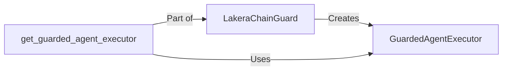

## Component Details

The Lakera ChainGuard system provides a mechanism to wrap an Agent Executor, monitoring inputs and outputs during the agent's execution. It uses sanitizers to identify harmful content and prevent potentially dangerous actions, ensuring that the agent operates within safe boundaries and does not perform unintended or malicious tasks. The core components work together to create a secure execution environment for agents.

### LakeraChainGuard
The main class responsible for creating a guarded agent executor. It initializes and configures the input and output sanitizers, setting up the necessary components for content moderation.
- **Related Classes/Methods**: `chainguard.lakera_chainguard.lakera_chainguard.LakeraChainGuard`

### get_guarded_agent_executor
A method within `LakeraChainGuard` that constructs and returns a `GuardedAgentExecutor`. It orchestrates the creation of the guarded executor by setting up sanitizers and wrapping the original agent executor.
- **Related Classes/Methods**: `chainguard.lakera_chainguard.lakera_chainguard.LakeraChainGuard:get_guarded_agent_executor`

### GuardedAgentExecutor
Wraps the original agent executor and applies sanitization to the inputs and outputs of the agent. It prevents potentially dangerous actions by using sanitizers to filter content.
- **Related Classes/Methods**: `chainguard.lakera_chainguard.lakera_chainguard.GuardedAgentExecutor`
