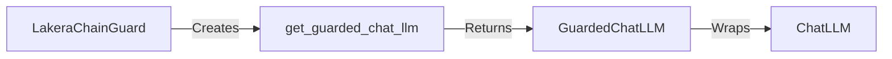

## Component Details

The ChatLLM Guard component focuses on providing safety and content filtering for chat-based language models. It wraps a Chat LLM, intercepts messages, and uses the Lakera API to analyze and filter content, ensuring safe and appropriate conversations. The main flow involves initializing the guard with API credentials, wrapping the Chat LLM, and then filtering messages during chat interactions.

### LakeraChainGuard
The LakeraChainGuard class serves as the main entry point for integrating Lakera's AI safety features into a project. It handles API authentication, configuration settings, and the creation of guarded language models. It is responsible for initializing the connection to the Lakera API and setting up the necessary configurations for content filtering.
- **Related Classes/Methods**: `chainguard.lakera_chainguard.lakera_chainguard.LakeraChainGuard`

### get_guarded_chat_llm
The get_guarded_chat_llm method, part of the LakeraChainGuard class, is responsible for creating and returning a guarded chat language model. This method takes a Chat LLM as input and wraps it with a guard that automatically filters outputs based on the configured safety settings. It leverages the Lakera API to perform the content filtering.
- **Related Classes/Methods**: `chainguard.lakera_chainguard.lakera_chainguard.LakeraChainGuard.get_guarded_chat_llm`

### GuardedChatLLM
The GuardedChatLLM class wraps a Chat LLM and applies safety filters to chat messages. It intercepts both the input and output of the Chat LLM, sending the content to the Lakera API for analysis and filtering. This ensures that the conversation remains safe and prevents the generation of harmful or inappropriate content.
- **Related Classes/Methods**: `chainguard.lakera_chainguard.lakera_chainguard.LakeraChainGuard.get_guarded_chat_llm.GuardedChatLLM`
