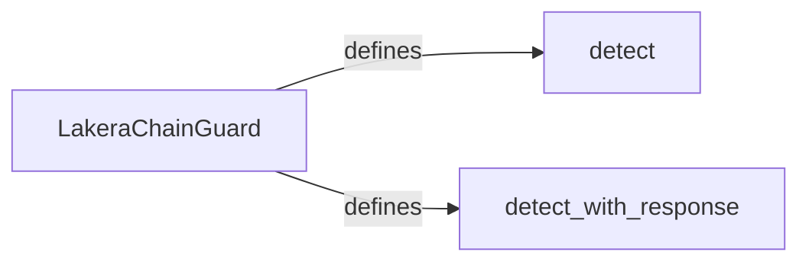

## Component Details

The content detection mechanism is implemented within the LakeraChainGuard class. It leverages the Lakera API to analyze text for potential threats. The process involves sending the input text to the Lakera API, receiving a response, and then interpreting the response to determine if any threats were detected. The `detect` method provides a simple boolean output, while the `detect_with_response` method offers a more detailed analysis of the detected threats.

### LakeraChainGuard
The LakeraChainGuard class serves as the primary interface for interacting with the Lakera API. It encapsulates the authentication process and provides methods for detecting threats in text. It initializes the API client with necessary credentials and offers functionalities to send text for analysis and retrieve threat detection results.
- **Related Classes/Methods**: `chainguard.lakera_chainguard.lakera_chainguard.LakeraChainGuard`

### detect
The `detect` method is a core function within the LakeraChainGuard class. It takes text as input and sends it to the Lakera API for threat analysis. Upon receiving the response, it processes the data to determine if any threats were detected. The method returns a boolean value, indicating the presence or absence of threats in the input text.
- **Related Classes/Methods**: `chainguard.lakera_chainguard.lakera_chainguard.LakeraChainGuard:detect`

### detect_with_response
The `detect_with_response` method extends the functionality of the `detect` method by providing a more detailed response from the Lakera API. In addition to detecting the presence of threats, this method returns comprehensive information about the identified threats, including their types and severity. This allows for a more granular analysis of the potential risks associated with the input text.
- **Related Classes/Methods**: `chainguard.lakera_chainguard.lakera_chainguard.LakeraChainGuard:detect_with_response`
