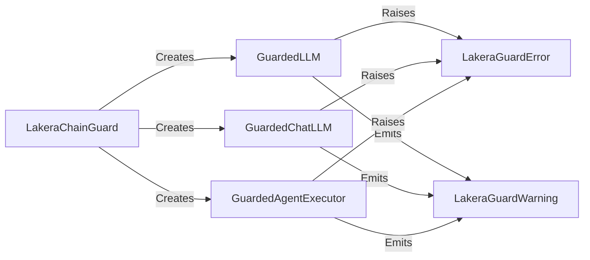

## Component Details

The LakeraChainGuard library provides a way to wrap language models, chat language models, and agent executors with guardrail functionality. It defines custom error and warning classes to handle exceptions and warnings related to the guardrail functionality, allowing for robust and informative error reporting and handling. The core components are LakeraChainGuard, GuardedLLM, GuardedChatLLM, GuardedAgentExecutor, LakeraGuardError, and LakeraGuardWarning. LakeraChainGuard creates instances of GuardedLLM, GuardedChatLLM, and GuardedAgentExecutor, which in turn may raise LakeraGuardError or emit LakeraGuardWarning during their operation.

### LakeraChainGuard
The main class for creating guarded language models, chat language models and agent executors. It provides methods to wrap existing LLMs and chat LLMs with guardrail functionality.
- **Related Classes/Methods**: `chainguard.lakera_chainguard.lakera_chainguard.LakeraChainGuard`

### GuardedLLM
A wrapper class for language models that adds guardrail functionality. It intercepts calls to the underlying LLM and applies policies or checks before and after the LLM is invoked.
- **Related Classes/Methods**: `chainguard.lakera_chainguard.lakera_chainguard.LakeraChainGuard.get_guarded_llm.GuardedLLM`

### GuardedChatLLM
A wrapper class for chat language models that adds guardrail functionality. Similar to GuardedLLM, it intercepts calls to the underlying chat LLM and applies policies or checks.
- **Related Classes/Methods**: `chainguard.lakera_chainguard.lakera_chainguard.LakeraChainGuard.get_guarded_chat_llm.GuardedChatLLM`

### LakeraGuardError
A custom exception class for errors related to the LakeraChainGuard library. It provides a structured way to handle exceptions and allows for more informative error reporting.
- **Related Classes/Methods**: `chainguard.lakera_chainguard.lakera_chainguard.LakeraGuardError`

### LakeraGuardWarning
A custom warning class for warnings related to the LakeraChainGuard library. It provides a structured way to handle warnings and allows for more informative warning reporting.
- **Related Classes/Methods**: `chainguard.lakera_chainguard.lakera_chainguard.LakeraGuardWarning`

### GuardedAgentExecutor
A wrapper class for agent executors that adds guardrail functionality. It intercepts calls to the underlying agent executor and applies policies or checks before and after the agent executor is invoked.
- **Related Classes/Methods**: `chainguard.lakera_chainguard.lakera_chainguard.LakeraChainGuard.get_guarded_agent_executor.GuardedAgentExecutor`
