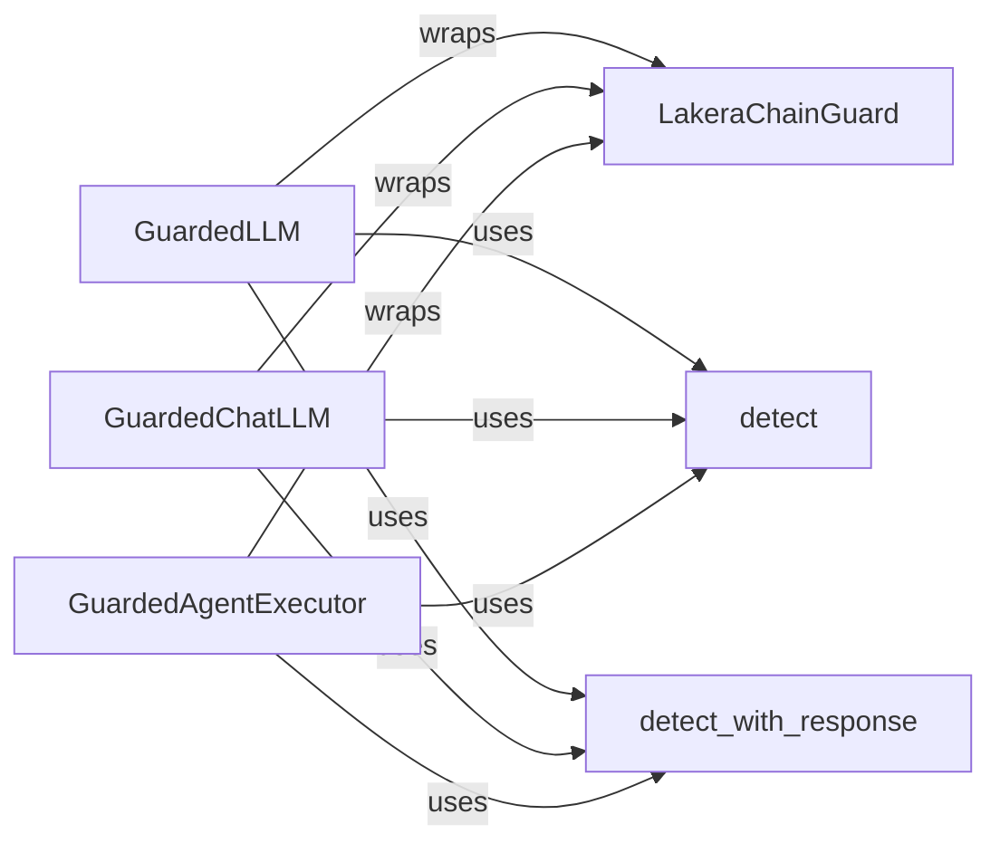

## Component Details

The LLM Guard component intercepts and analyzes both input prompts and generated responses of an LLM. It leverages the LakeraChainGuard to detect harmful content and applies actions based on the configured safety settings. This ensures that the LLM operates within defined guardrails, preventing the generation or exposure of unsafe content. The core functionality revolves around wrapping LLMs, Chat LLMs, and Agent Executors, using the `detect` and `detect_with_response` methods to assess content safety.

### LakeraChainGuard
The central class for integrating Lakera's safety checks into LLMs. It manages API key initialization, configuration settings, and provides methods to wrap different types of LLMs (standard, chat, agents) with safety checks. It acts as the main interface for interacting with the Lakera API.
- **Related Classes/Methods**: `chainguard.lakera_chainguard.lakera_chainguard.LakeraChainGuard`

### GuardedLLM
Wraps a standard LLM, intercepting input prompts before they are sent to the LLM and the responses generated by the LLM. It uses the `detect` or `detect_with_response` methods of `LakeraChainGuard` to check for harmful content in both prompts and responses, ensuring the LLM's interactions are safe.
- **Related Classes/Methods**: `chainguard.lakera_chainguard.lakera_chainguard.LakeraChainGuard.get_guarded_llm.GuardedLLM`

### GuardedChatLLM
Wraps a chat-based LLM, providing safety checks tailored for conversational models. Similar to `GuardedLLM`, it intercepts messages and responses, using `LakeraChainGuard`'s detection methods to identify and prevent harmful content in chat interactions.
- **Related Classes/Methods**: `chainguard.lakera_chainguard.lakera_chainguard.LakeraChainGuard.get_guarded_chat_llm`

### detect
Sends text to the Lakera API for analysis. This method is a core part of the content detection process, providing the raw API response for further processing. It's used by the GuardedLLM, GuardedChatLLM, and GuardedAgentExecutor to assess the safety of content.
- **Related Classes/Methods**: `chainguard.lakera_chainguard.lakera_chainguard.LakeraChainGuard:detect`

### detect_with_response
Sends text to Lakera's API for analysis and returns a structured response indicating whether the text is safe or unsafe. This provides a more user-friendly output than `detect`. It's used by the GuardedLLM, GuardedChatLLM, and GuardedAgentExecutor to assess the safety of content.
- **Related Classes/Methods**: `chainguard.lakera_chainguard.lakera_chainguard.LakeraChainGuard:detect_with_response`

### GuardedAgentExecutor
Wraps a Langchain AgentExecutor to add safety checks. It intercepts prompts and responses, using `LakeraChainGuard`'s detection methods to ensure safety within the agent execution environment. This prevents the agent from generating or acting upon harmful content.
- **Related Classes/Methods**: `chainguard.lakera_chainguard.lakera_chainguard.LakeraChainGuard:get_guarded_agent_executor`
