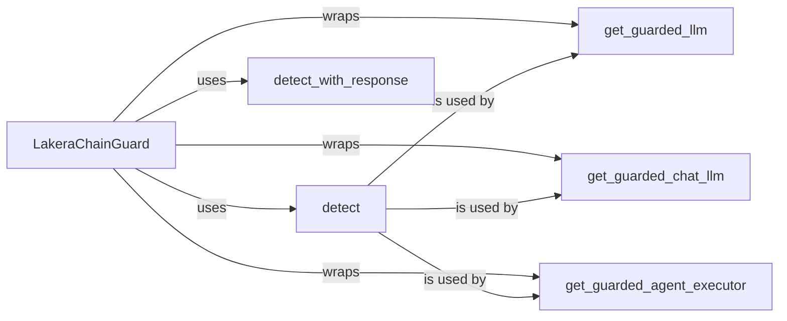

## Component Details

The LakeraChainGuard Core component acts as the central orchestrator for integrating Lakera's AI safety platform into LLMs, chat LLMs, and agent executors. It provides methods to wrap these components with safety checks, leveraging the `detect` and `detect_with_response` methods to analyze inputs and outputs for potential harm. The core class, `LakeraChainGuard`, serves as the main entry point, configuring the overall behavior of the guardrails and ensuring safe interactions with language models.

### LakeraChainGuard
The main class that encapsulates the integration with Lakera's AI safety platform. It provides methods for detecting harmful inputs and wrapping LLMs, chat LLMs, and agent executors with safety checks.
- **Related Classes/Methods**: `chainguard.lakera_chainguard.lakera_chainguard.LakeraChainGuard`

### detect
This method takes a text input and sends it to Lakera's API for analysis. It returns a boolean indicating whether the input is considered safe.
- **Related Classes/Methods**: `chainguard.lakera_chainguard.lakera_chainguard.LakeraChainGuard:detect`

### detect_with_response
This method takes a text input and sends it to Lakera's API for analysis. It returns the full API response, including the safety score and any detected issues.
- **Related Classes/Methods**: `chainguard.lakera_chainguard.lakera_chainguard.LakeraChainGuard:detect_with_response`

### get_guarded_llm
This method takes an LLM and returns a new LLM that is wrapped with safety checks. The guarded LLM will use the `detect` method to check inputs before sending them to the underlying LLM.
- **Related Classes/Methods**: `chainguard.lakera_chainguard.lakera_chainguard.LakeraChainGuard:get_guarded_llm`

### get_guarded_chat_llm
This method takes a chat LLM and returns a new chat LLM that is wrapped with safety checks. The guarded chat LLM will use the `detect` method to check inputs before sending them to the underlying chat LLM.
- **Related Classes/Methods**: `chainguard.lakera_chainguard.lakera_chainguard.LakeraChainGuard:get_guarded_chat_llm`

### get_guarded_agent_executor
This method takes an agent executor and returns a new agent executor that is wrapped with safety checks. The guarded agent executor will use the `detect` method to check inputs and outputs of the agent.
- **Related Classes/Methods**: `chainguard.lakera_chainguard.lakera_chainguard.LakeraChainGuard:get_guarded_agent_executor`
