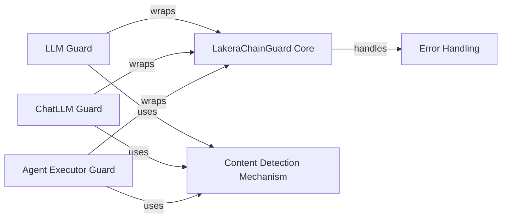

## Component Details

The LakeraChainGuard library provides a mechanism to add guardrails to Large Language Models (LLMs), Chat LLMs, and Agent Executors. It wraps these components and applies a detection mechanism to both the input prompts and the generated responses, ensuring that the interactions are safe and free from harmful content. The library also includes custom error handling for guardrail-related issues.

### LakeraChainGuard Core
The central component responsible for orchestrating the guardrail functionality. It provides methods to wrap LLMs, Chat LLMs, and Agent Executors, integrating the detection mechanism. It acts as the main entry point for using the library and configures the overall behavior of the guardrails.
- **Related Classes/Methods**: `chainguard.lakera_chainguard.lakera_chainguard.LakeraChainGuard`

### LLM Guard
This component wraps a standard LLM, intercepting both input prompts and generated responses. It utilizes the detection mechanism to identify harmful content and takes appropriate action based on the configured settings. It ensures that the LLM's inputs and outputs are safe and compliant with the defined guardrails.
- **Related Classes/Methods**: `chainguard.lakera_chainguard.lakera_chainguard.LakeraChainGuard.get_guarded_llm.GuardedLLM`

### ChatLLM Guard
Similar to the LLM Guard, the ChatLLM Guard wraps a Chat LLM, tailoring the guardrail functionality for chat-based models. It applies the detection mechanism to chat messages, ensuring the safety of conversations and preventing the generation or propagation of harmful content within chat interactions.
- **Related Classes/Methods**: `chainguard.lakera_chainguard.lakera_chainguard.LakeraChainGuard.get_guarded_chat_llm.GuardedChatLLM`

### Agent Executor Guard
The Agent Executor Guard wraps an Agent Executor, monitoring inputs and outputs during the agent's execution. It uses the detection mechanism to identify harmful content and prevent potentially dangerous actions, ensuring that the agent operates within safe boundaries and does not perform unintended or malicious tasks.
- **Related Classes/Methods**: `chainguard.lakera_chainguard.lakera_chainguard.LakeraChainGuard.get_guarded_agent_executor.GuardedAgentExecutor`

### Content Detection Mechanism
This core component is responsible for detecting harmful content in prompts and responses. It likely employs various techniques, such as regular expressions, machine learning models, or external APIs, to identify potentially malicious or inappropriate text. It is the central logic for content filtering and risk assessment.
- **Related Classes/Methods**: `chainguard.lakera_chainguard.lakera_chainguard.LakeraChainGuard:detect`, `chainguard.lakera_chainguard.lakera_chainguard.LakeraChainGuard:detect_with_response`

### Error Handling
This component defines custom error and warning classes specific to the LakeraChainGuard library. These classes provide a structured way to handle exceptions and warnings related to the guardrail functionality, allowing for more robust and informative error reporting and handling within the library.
- **Related Classes/Methods**: `chainguard.lakera_chainguard.lakera_chainguard.LakeraGuardError`, `chainguard.lakera_chainguard.lakera_chainguard.LakeraGuardWarning`