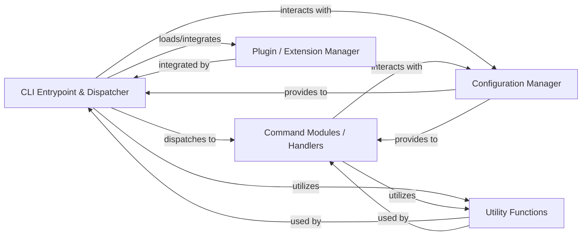

## Details

The charmcraft CLI application is structured around a clear command-dispatching pattern. The CLI Entrypoint & Dispatcher component, rooted in charmcraft.application.main, serves as the central orchestrator, responsible for interpreting user commands and directing them to the appropriate Command Modules / Handlers (found within charmcraft.application.commands). These handlers encapsulate the specific logic for each charmcraft operation. Both the dispatcher and the command handlers extensively leverage the Configuration Manager (charmcraft.models) for accessing application and command-specific settings, and the Utility Functions (charmcraft.utils) for common, reusable operations. Furthermore, the system is designed for extensibility, with the Plugin / Extension Manager (charmcraft.extensions) allowing for dynamic integration of additional functionalities, primarily managed by the main dispatcher. This architecture ensures a modular, maintainable, and extensible CLI application.

### CLI Entrypoint & Dispatcher [[Expand]](./CLI_Entrypoint_Dispatcher.md)
The primary component responsible for parsing command-line arguments, initializing the application environment, and routing requests to the appropriate command handlers. It acts as the central orchestrator for all charmcraft operations.

**Related Classes/Methods**:

- <a href="https://github.com/canonical/charmcraft/blob/main/charmcraft/application/main.py#L158-L162" target="_blank" rel="noopener noreferrer">`charmcraft.application.main.main`:158-162</a>

### Command Modules / Handlers
Contains the concrete implementations for each charmcraft command (e.g., init, pack, upload). Each handler encapsulates the specific business logic for its command.

**Related Classes/Methods**:

- <a href="https://github.com/canonical/charmcraft/blob/main/charmcraft/application/commands/base.py" target="_blank" rel="noopener noreferrer">`charmcraft.application.commands.base.BaseCommand`</a>

### Configuration Manager
Manages data structures and configuration models used throughout the application, including those necessary for initial setup and command execution.

**Related Classes/Methods**:

- <a href="https://github.com/canonical/charmcraft/blob/main/charmcraft/models" target="_blank" rel="noopener noreferrer">`charmcraft.models`</a>

### Utility Functions
Provides general-purpose utility functions and helpers used across different parts of the application, including initial setup and command processing.

**Related Classes/Methods**:

- <a href="https://github.com/canonical/charmcraft/blob/main/charmcraft/utils" target="_blank" rel="noopener noreferrer">`charmcraft.utils`</a>

### Plugin / Extension Manager
Provides the mechanism for loading, managing, and integrating extensions that augment charmcraft's functionality. The dispatcher interacts with this to enable extensible behavior.

**Related Classes/Methods**:

- <a href="https://github.com/canonical/charmcraft/blob/main/charmcraft/extensions" target="_blank" rel="noopener noreferrer">`charmcraft.extensions`</a>

### [FAQ](https://github.com/CodeBoarding/GeneratedOnBoardings/tree/main?tab=readme-ov-file#faq)