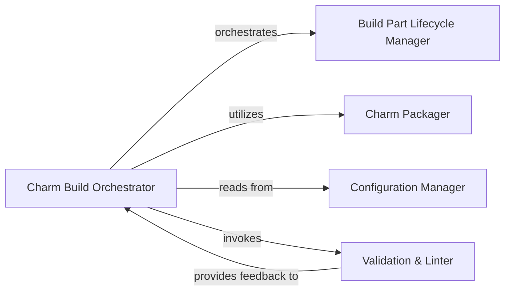

## Details

The `charmcraft` build system is orchestrated by the Charm Build Orchestrator, which directs the entire charm creation workflow. It leverages the Configuration Manager to load and interpret project-specific settings and build parameters. Individual build steps are managed by the Build Part Lifecycle Manager, ensuring proper execution within defined environments. Once build artifacts are ready, the Charm Packager takes over to assemble and archive the final `.charm` file, performing necessary file system operations. Throughout the process, the Validation & Linter component ensures adherence to charm specifications and best practices, providing critical feedback to the orchestrator. This modular design allows for clear separation of concerns and efficient management of the charm build pipeline.

### Charm Build Orchestrator [[Expand]](./Charm_Build_Orchestrator.md)
The primary coordinator for the entire charm building process. It manages the sequence of build steps, from preparing the source and resolving dependencies to executing build plugins and initiating the final packaging. It acts as the central control flow for the build pipeline.

**Related Classes/Methods**:

- <a href="https://github.com/canonical/charmcraft/blob/main/charmcraft/charm_builder.py#L57-L376" target="_blank" rel="noopener noreferrer">`charmcraft.charm_builder.CharmBuilder`:57-376</a>

### Build Part Lifecycle Manager
Defines and manages the lifecycle hooks and execution environment for individual charm build parts, including their setup, build, and prime phases. It ensures that each part is processed correctly within its isolated environment.

**Related Classes/Methods**:

- <a href="https://github.com/canonical/charmcraft/blob/main/charmcraft/parts/lifecycle.py" target="_blank" rel="noopener noreferrer">`charmcraft.parts.lifecycle`</a>

### Charm Packager
Responsible for collecting all necessary build artifacts, metadata, and files, then compressing and archiving them into the final `.charm` distributable format. It ensures the final package adheres to charm specifications and is ready for deployment, utilizing file system operations for artifact collection and archiving.

**Related Classes/Methods**:

- <a href="https://github.com/canonical/charmcraft/blob/main/charmcraft/services/package.py" target="_blank" rel="noopener noreferrer">`charmcraft.services.package`</a>

### Configuration Manager
Handles the loading, parsing, and provision of configuration settings for the charm build process, typically sourced from `charmcraft.yaml` and Juju-specific configurations. It ensures that build parameters and project-specific settings are accessible to other components.

**Related Classes/Methods**:

- <a href="https://github.com/canonical/charmcraft/blob/main/charmcraft/models/charmcraft.py" target="_blank" rel="noopener noreferrer">`charmcraft.models.charmcraft`</a>
- <a href="https://github.com/canonical/charmcraft/blob/main/charmcraft/models/config.py" target="_blank" rel="noopener noreferrer">`charmcraft.models.config`</a>

### Validation & Linter
Performs validation and linting checks on the charm project's structure, content, and adherence to best practices and specifications. It identifies and reports potential issues or errors that could affect charm integrity or deployment, providing feedback to the Charm Build Orchestrator.

**Related Classes/Methods**:

- <a href="https://github.com/canonical/charmcraft/blob/main/charmcraft/models/charmcraft.py" target="_blank" rel="noopener noreferrer">`charmcraft.linters`</a>

### [FAQ](https://github.com/CodeBoarding/GeneratedOnBoardings/tree/main?tab=readme-ov-file#faq)