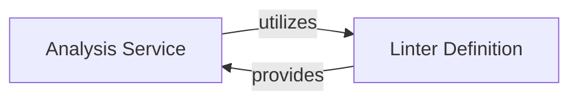

## Details

The Charm Linter & Analyzer subsystem is responsible for performing static analysis and applying linting rules to charm projects, ensuring code quality and adherence to best practices. It exhibits a clear orchestrator-plugin relationship, where the Analysis Service acts as the orchestrator, driving the linting process, and the Linter Definition provides the blueprint for the 'plugins' (individual linter rules) that the orchestrator will discover and execute. This design promotes modularity, allowing new linting rules to be added by simply implementing the Linter interface without modifying the core analysis workflow.

### Analysis Service
This component, represented by `charmcraft.services.analysis`, orchestrates the entire static analysis and linting workflow. Its responsibilities include discovering available linters, loading the charm project's structure and content, iterating through and executing individual linter checks, and finally aggregating and reporting the results. It acts as the primary entry point for initiating charm project analysis.

**Related Classes/Methods**:

- <a href="https://github.com/canonical/charmcraft/blob/main/charmcraft/services/analysis.py" target="_blank" rel="noopener noreferrer">`charmcraft.services.analysis`</a>

### Linter Definition
This component, represented by `charmcraft.linters.Linter`, defines the abstract contract and common functionality for all individual linting rules. It provides a standardized interface that concrete linter implementations must adhere to, ensuring consistency and extensibility within the linting framework. This component is fundamental for defining what a "linter" is within the charmcraft ecosystem.

**Related Classes/Methods**:

- <a href="https://github.com/canonical/charmcraft/blob/main/charmcraft/linters.py#L133-L138" target="_blank" rel="noopener noreferrer">`charmcraft.linters.Linter`:133-138</a>

### [FAQ](https://github.com/CodeBoarding/GeneratedOnBoardings/tree/main?tab=readme-ov-file#faq)