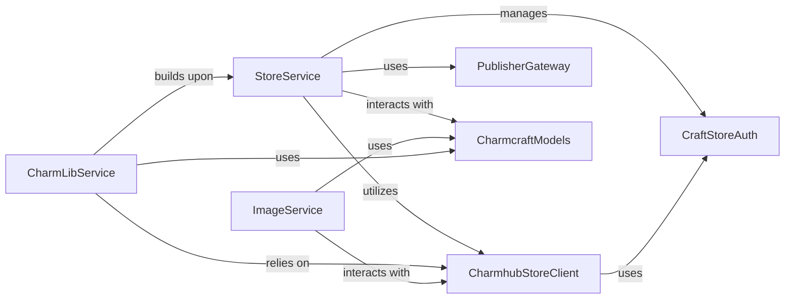

## Details

The charmcraft store subsystem is designed around a service-oriented architecture, with StoreService acting as the central orchestrator for Charmhub interactions. It delegates specialized tasks to CharmLibService for library management and ImageService for OCI image operations. All external communication with Charmhub is handled by the CharmhubStoreClient, which provides both authenticated and anonymous access. Authentication concerns are managed by CraftStoreAuth, ensuring secure interactions. Data consistency across the API is maintained through CharmcraftModels, which defines the necessary data structures. The PublisherGateway represents the logical grouping of publishing functionalities, primarily managed by StoreService and its underlying interactions with CharmhubStoreClient. This layered approach ensures clear separation of concerns, reusability of the Charmhub communication layer, and maintainability of the overall system. Critical Interaction Pathways: Charm Release Flow: StoreService initiates charm releases, utilizing PublisherGateway (conceptual) to interact with CharmhubStoreClient for API calls, and relying on CharmcraftModels for data formatting. Library Management Flow: CharmLibService builds upon StoreService to manage charm libraries, directly interacting with CharmhubStoreClient and using CharmcraftModels for data. Image Operations Flow: ImageService handles OCI image tasks by directly interacting with CharmhubStoreClient and leveraging CharmcraftModels for data structures. Authentication Flow: CharmhubStoreClient relies on CraftStoreAuth to manage credentials and sessions for all authenticated Charmhub interactions.

### StoreService
Acts as the primary orchestrator for Charmhub interactions, managing charm releases, package metadata, and resource updates. It coordinates high-level operations such as releasing charm revisions, promoting releases, creating tracks, and setting resource architectures.

**Related Classes/Methods**:

- <a href="https://github.com/canonical/charmcraft/blob/main/charmcraft/services/store.py#L44-L185" target="_blank" rel="noopener noreferrer">`StoreService`:44-185</a>

### CharmLibService
Specializes in managing operations related to charm libraries, including fetching, publishing, and their lifecycle within Charmhub. It builds upon the StoreService for underlying Charmhub communication capabilities.

**Related Classes/Methods**:

- <a href="https://github.com/canonical/charmcraft/blob/main/charmcraft/services/charmlibs.py#L1-L10000" target="_blank" rel="noopener noreferrer">`CharmLibService`:1-10000</a>

### ImageService
Focuses on OCI (Open Container Initiative) image-related operations within the Charmhub context, such as copying and inspecting images. It directly interacts with the Charmhub API for these specialized tasks.

**Related Classes/Methods**:

- <a href="https://github.com/canonical/charmcraft/blob/main/charmcraft/services/image.py#L49-L177" target="_blank" rel="noopener noreferrer">`ImageService`:49-177</a>

### CharmhubStoreClient
Provides the low-level, direct API communication layer with Charmhub. It encapsulates both authenticated (Client) and anonymous (AnonymousClient) access, serving as the fundamental component for all external Charmhub requests.

**Related Classes/Methods**:

- <a href="https://github.com/canonical/charmcraft/blob/main/charmcraft/store/client.py#L1-L10000" target="_blank" rel="noopener noreferrer">`CharmhubStoreClient`:1-10000</a>

### PublisherGateway
Encapsulates specific publishing functionalities, such as releasing new charm revisions and creating tracks on Charmhub. It abstracts these complex operations, providing a simplified interface for the StoreService.

**Related Classes/Methods**:

- <a href="https://github.com/canonical/charmcraft/blob/main/charmcraft/services/store.py#L1-L10000" target="_blank" rel="noopener noreferrer">`PublisherGateway`:1-10000</a>

### CraftStoreAuth
Manages the authentication process with Charmhub, handling credentials and session management to ensure secure and authorized interactions for all Charmhub operations.

**Related Classes/Methods**:

- <a href="https://github.com/canonical/charmcraft/blob/main/charmcraft/store/client.py#L1-L10000" target="_blank" rel="noopener noreferrer">`CraftStoreAuth`:1-10000</a>

### CharmcraftModels
Defines the data structures (models) for requests and responses exchanged during interactions with the Charmhub API. This ensures consistent data formatting and adherence to the API contract across the entire subsystem.

**Related Classes/Methods**:

- <a href="https://github.com/canonical/charmcraft/blob/main/charmcraft/store/models.py#L1-L10000" target="_blank" rel="noopener noreferrer">`CharmcraftModels`:1-10000</a>

### [FAQ](https://github.com/CodeBoarding/GeneratedOnBoardings/tree/main?tab=readme-ov-file#faq)