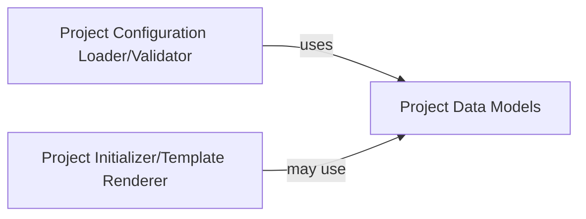

## Details

The `Project Configuration & Template Manager` subsystem is crucial for initializing new charm projects and managing their metadata. It acts as the central hub for defining, validating, and applying project-specific configurations.

### Project Configuration Loader/Validator
This component is responsible for reading, parsing, and validating `charmcraft.yaml` and `metadata.yaml` files against predefined schemas. It ensures that project configuration data adheres to expected formats and provides structured access to this data for other components.

**Related Classes/Methods**:

- <a href="https://github.com/canonical/charmcraft/blob/main/charmcraft/services/project.py" target="_blank" rel="noopener noreferrer">`charmcraft.services.project`</a>
- <a href="https://github.com/canonical/charmcraft/blob/main/charmcraft/models/project.py" target="_blank" rel="noopener noreferrer">`charmcraft.models.project`</a>
- <a href="https://github.com/canonical/charmcraft/blob/main/charmcraft/utils/__init__.py" target="_blank" rel="noopener noreferrer">`charmcraft.utils`</a>

### Project Data Models
This component defines the canonical data structures, typically using Pydantic models, for representing charm project metadata and configuration. It ensures type safety, consistency, and facilitates data validation across the application.

**Related Classes/Methods**:

- <a href="https://github.com/canonical/charmcraft/blob/main/charmcraft/models/project.py" target="_blank" rel="noopener noreferrer">`charmcraft.models.project`</a>

### Project Initializer/Template Renderer
Manages the end-to-end process of creating new charm projects from predefined templates. This includes copying template files, rendering dynamic content based on user input or project configuration, and setting up the initial project directory structure.

**Related Classes/Methods**:

- <a href="https://github.com/canonical/charmcraft/blob/main/charmcraft/services/project.py" target="_blank" rel="noopener noreferrer">`charmcraft.services.project`</a>
- <a href="https://github.com/canonical/charmcraft/blob/main/charmcraft/application/commands/init.py" target="_blank" rel="noopener noreferrer">`charmcraft.application.commands.init`</a>
- <a href="https://github.com/canonical/charmcraft/blob/main/charmcraft/utils/__init__.py" target="_blank" rel="noopener noreferrer">`charmcraft.utils`</a>
- <a href="https://github.com/canonical/charmcraft/blob/main/charmcraft/models/project.py" target="_blank" rel="noopener noreferrer">`charmcraft.models.project`</a>

### [FAQ](https://github.com/CodeBoarding/GeneratedOnBoardings/tree/main?tab=readme-ov-file#faq)