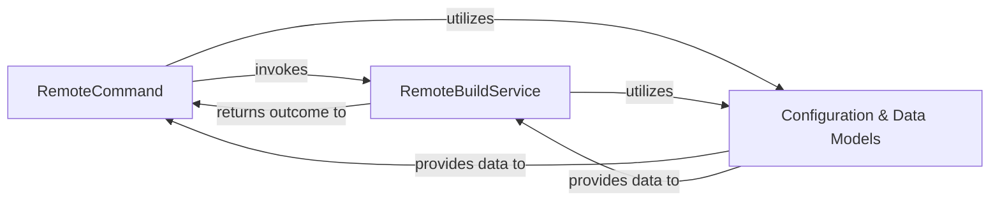

## Details

The charmcraft remote build subsystem orchestrates the process of building charms remotely. The RemoteCommand acts as the primary user interface, handling command-line interactions and delegating the core build logic to the RemoteBuildService. Both components rely on the Configuration & Data Models to access necessary settings and structure data for build operations. This clear separation of concerns ensures a robust and maintainable architecture for remote charm development.

### RemoteCommand
This component acts as the CLI Interface / Command Dispatcher for remote build operations. It defines the `charmcraft remote` command and its subcommands, parses user arguments, orchestrates the user-facing workflow, and displays progress and results. It delegates the actual remote build execution to the `RemoteBuildService`.

**Related Classes/Methods**:

- <a href="https://github.com/canonical/charmcraft/blob/main/" target="_blank" rel="noopener noreferrer">`charmcraft.application.commands.remote`</a>

### RemoteBuildService
This component is the core Charm Packaging / Build Engine for remote builds. It is responsible for initiating remote charm builds, monitoring their status, retrieving completed build artifacts (e.g., `.charm` files), fetching build logs, and handling authentication with the external remote build service. It embodies the Client-Server pattern by interacting with an external service.

**Related Classes/Methods**:

- <a href="https://github.com/canonical/charmcraft/blob/main/" target="_blank" rel="noopener noreferrer">`charmcraft.services.remotebuild`</a>

### Configuration & Data Models
This component provides the necessary configuration parameters and data models required for both the `RemoteCommand` and `RemoteBuildService` to operate. This includes API endpoints, authentication credentials, build options, and data structures for representing build status or artifacts.

**Related Classes/Methods**:

- <a href="https://github.com/canonical/charmcraft/blob/main/" target="_blank" rel="noopener noreferrer">`charmcraft.models.config.Config`</a>

### [FAQ](https://github.com/CodeBoarding/GeneratedOnBoardings/tree/main?tab=readme-ov-file#faq)