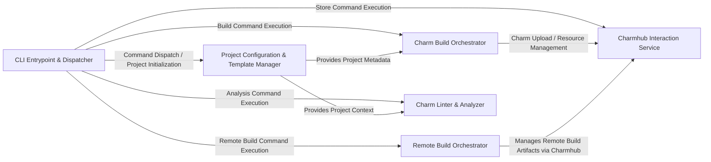

## Details

Charmcraft's architecture is designed around a modular command-line interface, where the `CLI Entrypoint & Dispatcher` serves as the central control point, routing user commands to dedicated functional components. The `Project Configuration & Template Manager` provides foundational project metadata and setup capabilities, which are consumed by the `Charm Build Orchestrator` for packaging charms and by the `Charm Linter & Analyzer` for code quality checks. The `Charm Build Orchestrator` is responsible for the end-to-end charm creation process, often interacting with the `Charmhub Interaction Service` for publishing artifacts. For distributed build workflows, the `Remote Build Orchestrator` manages external build processes, potentially leveraging the `Charmhub Interaction Service` for artifact exchange with the Charmhub store. This clear separation of concerns facilitates maintainability and extensibility, with well-defined data flows enabling efficient charm development and deployment.

### CLI Entrypoint & Dispatcher [[Expand]](./CLI_Entrypoint_Dispatcher.md)
The core user interface, responsible for parsing command-line arguments, initializing the application environment, and routing requests to the appropriate command handlers. It acts as the central orchestrator for all Charmcraft operations.

**Related Classes/Methods**:

- <a href="https://github.com/canonical/charmcraft/blob/main/charmcraft/application/main.py" target="_blank" rel="noopener noreferrer">`charmcraft.application.main.py`</a>

### Project Configuration & Template Manager [[Expand]](./Project_Configuration_Template_Manager.md)
Manages the loading, validation, and interpretation of charm project metadata and configuration files (e.g., `charmcraft.yaml`, `metadata.yaml`). It also provides and renders templates for initializing new charm projects.

**Related Classes/Methods**:

- <a href="https://github.com/canonical/charmcraft/blob/main/charmcraft/services/project.py" target="_blank" rel="noopener noreferrer">`charmcraft.services.project.py`</a>
- <a href="https://github.com/canonical/charmcraft/blob/main/charmcraft/models/project.py" target="_blank" rel="noopener noreferrer">`charmcraft.models.project.py`</a>
- <a href="https://github.com/canonical/charmcraft/blob/main/charmcraft/application/commands/init.py" target="_blank" rel="noopener noreferrer">`charmcraft.application.commands.init.py`</a>

### Charm Build Orchestrator [[Expand]](./Charm_Build_Orchestrator.md)
Orchestrates the entire charm building process, including preparing the source, resolving and handling dependencies, executing build plugins/parts, and finally packaging the charm into a distributable `.charm` archive.

**Related Classes/Methods**:

- <a href="https://github.com/canonical/charmcraft/blob/main/charmcraft/charm_builder.py#L57-L376" target="_blank" rel="noopener noreferrer">`charmcraft.charm_builder.CharmBuilder`:57-376</a>
- <a href="https://github.com/canonical/charmcraft/blob/main/charmcraft/parts/lifecycle.py" target="_blank" rel="noopener noreferrer">`charmcraft.parts.lifecycle.py`</a>
- <a href="https://github.com/canonical/charmcraft/blob/main/charmcraft/services/package.py" target="_blank" rel="noopener noreferrer">`charmcraft.services.package.py`</a>

### Charmhub Interaction Service [[Expand]](./Charmhub_Interaction_Service.md)
Provides a unified and authenticated interface for all interactions with the Charmhub store. This includes uploading charms and resources, managing releases, handling charm libraries (fetching/publishing), and managing OCI images (copying/inspecting).

**Related Classes/Methods**:

- <a href="https://github.com/canonical/charmcraft/blob/main/charmcraft/services/store.py" target="_blank" rel="noopener noreferrer">`charmcraft.services.store.py`</a>
- <a href="https://github.com/canonical/charmcraft/blob/main/charmcraft/services/charmlibs.py" target="_blank" rel="noopener noreferrer">`charmcraft.services.charmlibs.py`</a>
- <a href="https://github.com/canonical/charmcraft/blob/main/charmcraft/services/image.py" target="_blank" rel="noopener noreferrer">`charmcraft.services.image.py`</a>

### Remote Build Orchestrator [[Expand]](./Remote_Build_Orchestrator.md)
Manages the process of offloading charm builds to a remote build service. This component handles initiating remote builds, monitoring their status, and retrieving build artifacts and logs upon completion.

**Related Classes/Methods**:

- <a href="https://github.com/canonical/charmcraft/blob/main/charmcraft/services/remotebuild.py" target="_blank" rel="noopener noreferrer">`charmcraft.services.remotebuild.py`</a>
- <a href="https://github.com/canonical/charmcraft/blob/main/charmcraft/application/commands/remote.py" target="_blank" rel="noopener noreferrer">`charmcraft.application.commands.remote.py`</a>

### Charm Linter & Analyzer [[Expand]](./Charm_Linter_Analyzer.md)
Performs static analysis and applies linting rules to charm projects. Its purpose is to ensure code quality, adherence to best practices, and to identify potential issues or anti-patterns within the charm's structure and content.

**Related Classes/Methods**:

- <a href="https://github.com/canonical/charmcraft/blob/main/charmcraft/services/analysis.py" target="_blank" rel="noopener noreferrer">`charmcraft.services.analysis.py`</a>
- <a href="https://github.com/canonical/charmcraft/blob/main/charmcraft/linters.py#L133-L138" target="_blank" rel="noopener noreferrer">`charmcraft.linters.Linter`:133-138</a>

### [FAQ](https://github.com/CodeBoarding/GeneratedOnBoardings/tree/main?tab=readme-ov-file#faq)