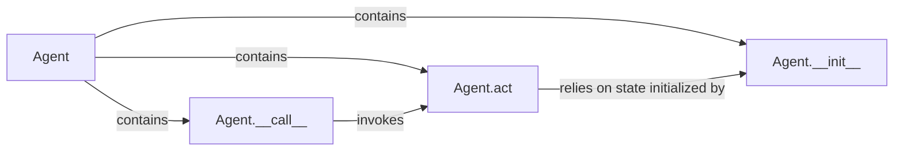

## Details

The `Agent/Player Manager` subsystem is a core part of the `chatarena` project, embodying the intelligent entities participating in language games. It adheres to the project's agent-based and component-based architectural patterns, providing a clear, modular definition for how agents are structured, initialized, and interact within the game environment.

### Agent
This is the core abstract component representing any participant (LLM-driven, human, or rule-based) in the multi-agent system. It defines the fundamental interface and common behaviors for intelligent entities in language game environments.

**Related Classes/Methods**:

- <a href="https://github.com/Farama-Foundation/chatarena/blob/main/chatarena/agent.py#L18-L38" target="_blank" rel="noopener noreferrer">`chatarena.agent.Agent`:18-38</a>

### Agent.__init__
This method is responsible for initializing the agent's essential attributes and internal state, including its unique identifier, potential links to a language model backend, and any internal memory or context management structures.

**Related Classes/Methods**:

- <a href="https://github.com/Farama-Foundation/chatarena/blob/main/chatarena/agent.py" target="_blank" rel="noopener noreferrer">`chatarena.agent.Agent:__init__`</a>

### Agent.__call__
This method serves as the primary external entry point for the `Arena` or `Environment` to prompt the agent to perform an action or generate a response during its turn. It acts as a high-level trigger for the agent's behavior.

**Related Classes/Methods**:

- <a href="https://github.com/Farama-Foundation/chatarena/blob/main/chatarena/agent.py" target="_blank" rel="noopener noreferrer">`chatarena.agent.Agent:__call__`</a>

### Agent.act
This method contains the core logic for the agent's decision-making process and action generation. It's where the agent processes the current game state, applies its specific strategy, and formulates its next move or utterance.

**Related Classes/Methods**:

- <a href="https://github.com/Farama-Foundation/chatarena/blob/main/chatarena/agent.py" target="_blank" rel="noopener noreferrer">`chatarena.agent.Agent:act`</a>

### [FAQ](https://github.com/CodeBoarding/GeneratedOnBoardings/tree/main?tab=readme-ov-file#faq)