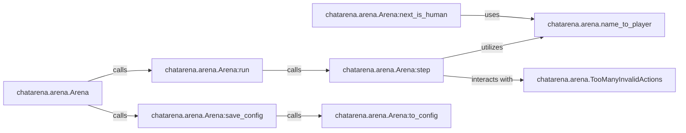

## Details

The `Arena Orchestrator` subsystem is the central control unit for managing the overall game flow, player turns, and interaction within the multi-agent language game environment.

### chatarena.arena.Arena
The central control unit that manages the overall game flow, player turns, and interaction with the environment. It acts as the conductor of the multi-agent language game, embodying the "Agent-Based Architecture" and "Component-Based Architecture" patterns.

**Related Classes/Methods**:

- <a href="https://github.com/Farama-Foundation/chatarena/blob/main/chatarena/arena.py#L17-L200" target="_blank" rel="noopener noreferrer">`chatarena.arena.Arena`:17-200</a>

### chatarena.arena.Arena:run
Initiates and manages the primary game loop, ensuring the game progresses turn by turn until a predefined termination condition is met. This method serves as a "Facade/API Gateway" for game execution.

**Related Classes/Methods**:

- <a href="https://github.com/Farama-Foundation/chatarena/blob/main/chatarena/arena.py" target="_blank" rel="noopener noreferrer">`chatarena.arena.Arena:run`</a>

### chatarena.arena.Arena:step
Executes a single turn within the game. This involves identifying the active player, allowing them to perform an action, and updating the game state. This component is crucial for granular control in "Multi-Agent Systems."

**Related Classes/Methods**:

- <a href="https://github.com/Farama-Foundation/chatarena/blob/main/chatarena/arena.py" target="_blank" rel="noopener noreferrer">`chatarena.arena.Arena:step`</a>

### chatarena.arena.Arena:next_is_human
A utility method within Arena that determines if the next player is human, leveraging `name_to_player`. It's part of the turn management logic.

**Related Classes/Methods**:

- <a href="https://github.com/Farama-Foundation/chatarena/blob/main/chatarena/arena.py" target="_blank" rel="noopener noreferrer">`chatarena.arena.Arena:next_is_human`</a>

### chatarena.arena.Arena:save_config
Responsible for persisting the Arena's configuration, internally calling `to_config`. This supports the "Configuration Management" aspect of the framework.

**Related Classes/Methods**:

- <a href="https://github.com/Farama-Foundation/chatarena/blob/main/chatarena/arena.py" target="_blank" rel="noopener noreferrer">`chatarena.arena.Arena:save_config`</a>

### chatarena.arena.Arena:to_config
Serializes the Arena's current state into a configurable format, enabling persistence and reusability of game setups.

**Related Classes/Methods**:

- <a href="https://github.com/Farama-Foundation/chatarena/blob/main/chatarena/arena.py" target="_blank" rel="noopener noreferrer">`chatarena.arena.Arena:to_config`</a>

### chatarena.arena.name_to_player
A helper function for resolving player objects by name, essential for the Arena to manage player turns and interactions.

**Related Classes/Methods**:

- <a href="https://github.com/Farama-Foundation/chatarena/blob/main/chatarena/arena.py#L36-L38" target="_blank" rel="noopener noreferrer">`chatarena.arena.name_to_player`:36-38</a>

### chatarena.arena.TooManyInvalidActions
An exception class for handling scenarios where players perform an excessive number of invalid actions, indicating a critical failure mode within the game progression.

**Related Classes/Methods**:

- <a href="https://github.com/Farama-Foundation/chatarena/blob/main/chatarena/arena.py#L13-L14" target="_blank" rel="noopener noreferrer">`chatarena.arena.TooManyInvalidActions`:13-14</a>

### [FAQ](https://github.com/CodeBoarding/GeneratedOnBoardings/tree/main?tab=readme-ov-file#faq)