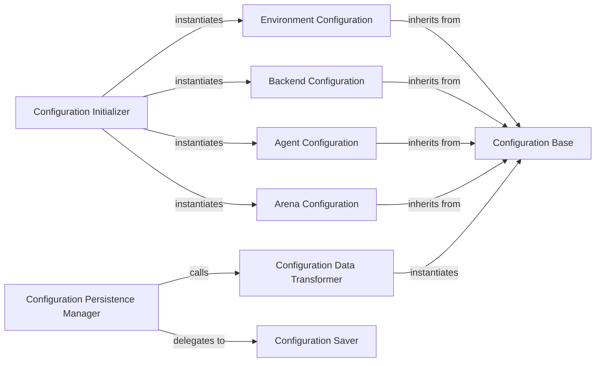

## Details

The `Configuration Manager` subsystem is responsible for the centralized handling of all configuration-related aspects within the `chatarena` project. This includes defining the structure of various configuration types, initializing them from diverse sources, and managing their persistence. It acts as the single source of truth for game, agent, and backend settings, ensuring consistency and modularity across the multi-agent language game environment.

### Configuration Base
Serves as the foundational, generic data structure for all configuration types. It defines common properties and an interface that all specialized configurations inherit or adhere to, ensuring consistency across the system. This is crucial for a modular LLM framework, allowing diverse components to share a common configuration paradigm.

**Related Classes/Methods**:

- <a href="https://github.com/Farama-Foundation/chatarena/blob/main/chatarena/config.py" target="_blank" rel="noopener noreferrer">`chatarena.config.Config`</a>

### Configuration Initializer
Acts as the primary entry point for creating and initializing various configuration objects. It orchestrates the instantiation of specific configuration types based on the application's needs during setup, centralizing the configuration loading process. This component is vital for setting up the environment, agents, and backends at runtime.

**Related Classes/Methods**:

- <a href="https://github.com/Farama-Foundation/chatarena/blob/main/chatarena/config.py#L122-L136" target="_blank" rel="noopener noreferrer">`chatarena.config.init_config`:122-136</a>

### Environment Configuration
Holds parameters and settings unique to game environments, such as rules, participant limits, or initial states. This specialized configuration allows for flexible and distinct environment setups, a core requirement for a multi-agent game framework.

**Related Classes/Methods**:

- <a href="https://github.com/Farama-Foundation/chatarena/blob/main/chatarena/config.py#L64-L71" target="_blank" rel="noopener noreferrer">`chatarena.config.EnvironmentConfig`:64-71</a>

### Backend Configuration
Encapsulates settings for different language model backends (e.g., API keys, model names, rate limits), allowing for flexible integration of various LLM providers. This component is critical for the framework's extensibility, enabling easy swapping or addition of new LLM services.

**Related Classes/Methods**:

- <a href="https://github.com/Farama-Foundation/chatarena/blob/main/chatarena/config.py#L74-L81" target="_blank" rel="noopener noreferrer">`chatarena.config.BackendConfig`:74-81</a>

### Agent Configuration
Defines parameters for individual agents, such as their roles, personalities, or specific model overrides, enabling diverse agent behaviors. This component supports the agent-based architecture by allowing fine-grained control over each participant's characteristics.

**Related Classes/Methods**:

- <a href="https://github.com/Farama-Foundation/chatarena/blob/main/chatarena/config.py#L84-L97" target="_blank" rel="noopener noreferrer">`chatarena.config.AgentConfig`:84-97</a>

### Arena Configuration
Contains global settings for the entire arena, orchestrating the overall game flow and interactions between agents and environments. This component provides the overarching configuration for the core game orchestrator.

**Related Classes/Methods**:

- <a href="https://github.com/Farama-Foundation/chatarena/blob/main/chatarena/config.py#L100-L118" target="_blank" rel="noopener noreferrer">`chatarena.config.ArenaConfig`:100-118</a>

### Configuration Data Transformer
Responsible for data transformation, converting arbitrary input data or objects into a standardized `Config` object, ensuring data consistency before processing or saving. This utility is essential for robust configuration handling from various input formats.

**Related Classes/Methods**:

- <a href="https://github.com/Farama-Foundation/chatarena/blob/main/chatarena/config.py#L56-L58" target="_blank" rel="noopener noreferrer">`chatarena.config.to_config`:56-58</a>

### Configuration Persistence Manager
Manages the workflow of preparing configuration data for persistence and delegates the actual write operation. It acts as an orchestration layer for saving, ensuring that configurations can be reliably stored and retrieved. This is vital for reproducibility and state management in a game environment.

**Related Classes/Methods**:

- <a href="https://github.com/Farama-Foundation/chatarena/blob/main/chatarena/config.py#L60-L61" target="_blank" rel="noopener noreferrer">`chatarena.config.save_config`:60-61</a>

### Configuration Saver
The low-level writer responsible for the actual write operation of configuration data.

**Related Classes/Methods**:

- <a href="https://github.com/Farama-Foundation/chatarena/blob/main/chatarena/config.py#L27-L30" target="_blank" rel="noopener noreferrer">`chatarena.config.save`:27-30</a>

### [FAQ](https://github.com/CodeBoarding/GeneratedOnBoardings/tree/main?tab=readme-ov-file#faq)