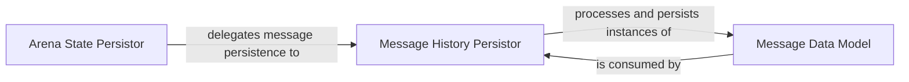

## Details

The `Data Persistence Layer` subsystem is responsible for managing the storage and retrieval of critical game state information, including the overall arena state, player configurations, and the complete history of messages exchanged during a game. This layer ensures that game progress and data are preserved across sessions.

### Arena State Persistor
This component acts as the high-level orchestrator for persisting the entire state of the game arena. It coordinates the saving of the environment, player configurations, and delegates the persistence of the message history to a specialized component. Its role is crucial for checkpointing and resuming complex multi-agent game sessions.

**Related Classes/Methods**:

- <a href="https://github.com/Farama-Foundation/chatarena/blob/main/chatarena/database.py#L37-L45" target="_blank" rel="noopener noreferrer">`chatarena.database.save_arena`:37-45</a>

### Message History Persistor
Dedicated to the efficient and structured storage of individual `Message` objects, this component manages the chat history of the arena. It handles the serialization of message instances into a format suitable for persistent storage, ensuring that all communications are accurately recorded and retrievable.

**Related Classes/Methods**:

- <a href="https://github.com/Farama-Foundation/chatarena/blob/main/chatarena/database.py#L95-L120" target="_blank" rel="noopener noreferrer">`chatarena.database.save_messages`:95-120</a>

### Message Data Model
This component defines the canonical structure and content of a single message exchanged within the chat arena. It serves as the fundamental data unit for all communication within the system and is critically important for how messages are processed and persisted by the `Message History Persistor`.

**Related Classes/Methods**:

- <a href="https://github.com/Farama-Foundation/chatarena/blob/main/chatarena/message.py" target="_blank" rel="noopener noreferrer">`chatarena.message.Message`</a>

### [FAQ](https://github.com/CodeBoarding/GeneratedOnBoardings/tree/main?tab=readme-ov-file#faq)