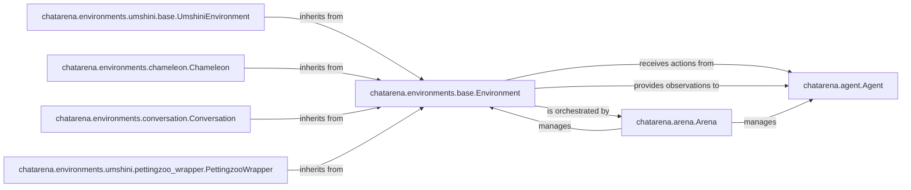

## Details

The `chatarena` project is structured around a core set of components that facilitate the creation and execution of language-based games. The `chatarena.arena.Arena` acts as the central orchestrator, managing the overall game flow. It initializes and coordinates interactions between `chatarena.agent.Agent` instances (representing players) and the `chatarena.environments.base.Environment`. The `Environment` component defines the rules and state of a specific game, receiving actions from agents and providing observations back to them. Specialized environments like `UmshiniEnvironment`, `Chameleon`, `Conversation`, and `PettingzooWrapper` extend the base `Environment` to implement diverse game mechanics or integrate external game frameworks. This architecture promotes modularity, allowing for flexible development of new agents and game environments within a consistent framework.

### chatarena.environments.base.Environment
This is the abstract base class that defines the fundamental interface and contract for all language game environments. It provides the core mechanisms for managing game state, processing agent actions, providing observations, and determining game outcomes. It serves as the primary abstraction for game logic.

**Related Classes/Methods**:

- <a href="https://github.com/Farama-Foundation/chatarena/blob/main/chatarena/environments/base.py#L28-L187" target="_blank" rel="noopener noreferrer">`chatarena.environments.base.Environment`:28-187</a>

### chatarena.agent.Agent
Represents an abstract participant in the language game. Agents interact with the environment by taking actions and receiving observations. This component defines the core interface for all types of players, whether human or AI-driven.

**Related Classes/Methods**:

- <a href="https://github.com/Farama-Foundation/chatarena/blob/main/chatarena/agent.py#L18-L38" target="_blank" rel="noopener noreferrer">`chatarena.agent.Agent`:18-38</a>

### chatarena.arena.Arena
The central orchestrator of the language game. The Arena manages the game flow, initializes the environment and agents, facilitates interactions between agents and the environment, and oversees the progression and termination of the game.

**Related Classes/Methods**:

- <a href="https://github.com/Farama-Foundation/chatarena/blob/main/chatarena/arena.py#L17-L200" target="_blank" rel="noopener noreferrer">`chatarena.arena.Arena`:17-200</a>

### chatarena.environments.umshini.base.UmshiniEnvironment
A specialized abstract base class designed for environments within the Umshini framework. It extends the base `Environment` with functionalities specific to Umshini games, providing a common foundation for more complex, domain-specific environments.

**Related Classes/Methods**:

- <a href="https://github.com/Farama-Foundation/chatarena/blob/main/chatarena/environments/umshini/base.py" target="_blank" rel="noopener noreferrer">`chatarena.environments.umshini.base.UmshiniEnvironment`</a>

### chatarena.environments.chameleon.Chameleon
A concrete implementation of a social deduction game environment. It inherits from `chatarena.environments.base.Environment` and implements the specific rules, state transitions, and interaction logic for the Chameleon game.

**Related Classes/Methods**:

- <a href="https://github.com/Farama-Foundation/chatarena/blob/main/chatarena/environments/chameleon.py#L53-L335" target="_blank" rel="noopener noreferrer">`chatarena.environments.chameleon.Chameleon`:53-335</a>

### chatarena.environments.conversation.Conversation
A concrete environment designed for general conversational game dynamics. It provides a flexible structure for managing turn-based or free-form conversations between agents, inheriting from `chatarena.environments.base.Environment`.

**Related Classes/Methods**:

- <a href="https://github.com/Farama-Foundation/chatarena/blob/main/chatarena/environments/conversation.py#L9-L94" target="_blank" rel="noopener noreferrer">`chatarena.environments.conversation.Conversation`:9-94</a>

### chatarena.environments.umshini.pettingzoo_wrapper.PettingzooWrapper
An adapter class that integrates external PettingZoo environments into the `chatarena` framework. It wraps PettingZoo environments, making them compatible with the `chatarena.environments.base.Environment` interface.

**Related Classes/Methods**:

- <a href="https://github.com/Farama-Foundation/chatarena/blob/main/chatarena/environments/umshini/pettingzoo_wrapper.py" target="_blank" rel="noopener noreferrer">`chatarena.environments.umshini.pettingzoo_wrapper.PettingzooWrapper`</a>

### [FAQ](https://github.com/CodeBoarding/GeneratedOnBoardings/tree/main?tab=readme-ov-file#faq)