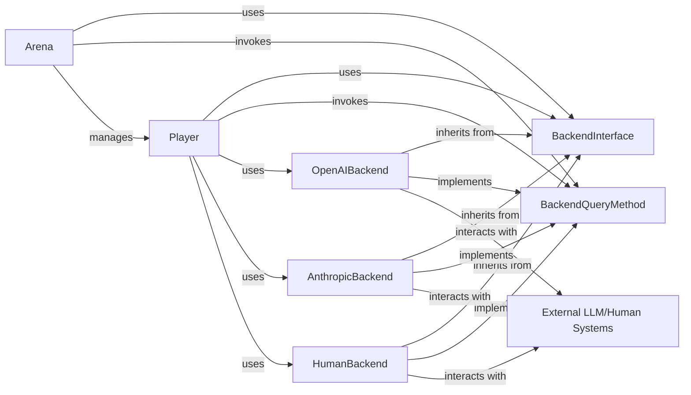

## Details

The `chatarena` subsystem is designed around a flexible backend architecture, enabling seamless integration with various Large Language Models (LLMs) and human participants. The `BackendInterface` serves as the central abstraction, defining a `query` method that all concrete backend implementations, such as `OpenAIBackend`, `AnthropicBackend`, and `HumanBackend`, must adhere to. This adherence ensures a consistent interaction mechanism with external LLM/Human Systems. The `Arena` component acts as the orchestrator, managing `Player` components and the game environment. Each `Player` is configured with a specific `BackendInterface` implementation, allowing them to interact with the chosen LLM or human. The `Arena` drives the game by stepping through turns, where players take actions by invoking the `BackendQueryMethod` of their assigned backend, ultimately communicating with the external systems to generate responses. This design promotes modularity and extensibility, allowing new LLM backends to be integrated without altering the core `Arena` or `Player` logic.

### BackendInterface
This is the foundational abstract interface (`chatarena.backends.base.Backend`) for all language model and human input backends. It defines the common contract, specifically the `query` method, that all concrete backend implementations must adhere to. This design pattern aligns perfectly with the **Strategy Pattern**, where `Backend` serves as the `Strategy` interface, ensuring a uniform interaction mechanism for the `chatarena` system regardless of the underlying LLM provider.

**Related Classes/Methods**:

- <a href="https://github.com/Farama-Foundation/chatarena/blob/main/chatarena/backends/base.py" target="_blank" rel="noopener noreferrer">`chatarena.backends.base.Backend`</a>

### BackendQueryMethod
This abstract method, defined within `BackendInterface` (`chatarena.backends.base.Backend:query`), is the primary entry point for sending a query to any backend. Its concrete implementation in subclasses handles the actual communication with the respective LLM or human interface, embodying the polymorphic behavior of the subsystem.

**Related Classes/Methods**:

- <a href="https://github.com/Farama-Foundation/chatarena/blob/main/chatarena/backends/base.py" target="_blank" rel="noopener noreferrer">`chatarena.backends.base.Backend:query`</a>

### OpenAIBackend
A concrete implementation of `BackendInterface` (`chatarena.backends.openai.OpenAIBackend`) that encapsulates the specific logic for interacting with the OpenAI API. Its core responsibility is to implement the `query` method according to OpenAI's API requirements, including request formatting, making API calls, and parsing responses. It acts as an **Adapter** for the OpenAI service.

**Related Classes/Methods**:

- <a href="https://github.com/Farama-Foundation/chatarena/blob/main/chatarena/backends/openai.py" target="_blank" rel="noopener noreferrer">`chatarena.backends.openai.OpenAIBackend`</a>

### AnthropicBackend
A concrete implementation of `BackendInterface` (`chatarena.backends.anthropic.AnthropicBackend`) responsible for interacting with the Anthropic API. Similar to `OpenAIBackend`, it adapts the generic `BackendInterface` to the specific Anthropic API, handling request/response translation.

**Related Classes/Methods**:

- <a href="https://github.com/Farama-Foundation/chatarena/blob/main/chatarena/backends/anthropic.py" target="_blank" rel="noopener noreferrer">`chatarena.backends.anthropic.AnthropicBackend`</a>

### HumanBackend
A concrete implementation of `BackendInterface` (`chatarena.backends.human.HumanBackend`) that facilitates interaction with human users. This component allows human input to be treated uniformly as if it were from an LLM, demonstrating the interface's versatility.

**Related Classes/Methods**:

- <a href="https://github.com/Farama-Foundation/chatarena/blob/main/chatarena/backends/human.py#L6-L9" target="_blank" rel="noopener noreferrer">`chatarena.backends.human.HumanBackend`:6-9</a>

### External LLM/Human Systems
This represents the external Large Language Model APIs (e.g., OpenAI, Anthropic, Hugging Face models, Bard, Cohere) and human users that the concrete backend implementations communicate with. These are the ultimate sources of responses to queries.

**Related Classes/Methods**: _None_

### Arena
The core orchestrator of the multi-agent language game environment. The `Arena` component interacts with the `Language Backend Interface` to facilitate communication between players and their chosen language models or human inputs. It relies on the standardized `query` method. It manages players and the environment, stepping through the game and handling player actions.

**Related Classes/Methods**:

- <a href="https://github.com/Farama-Foundation/chatarena/blob/main/chatarena/arena.py#L17-L200" target="_blank" rel="noopener noreferrer">`chatarena.arena.Arena`:17-200</a>

### Player
Represents an individual agent participating in the game. Each `Player` is configured to use a specific `Language Backend Interface` implementation (e.g., `OpenAIBackend`, `HumanBackend`) to generate responses or actions within the game. Players are managed by the `Arena`.

**Related Classes/Methods**:

- <a href="https://github.com/Farama-Foundation/chatarena/blob/main/chatarena/agent.py#L18-L38" target="_blank" rel="noopener noreferrer">`chatarena.agent.Agent`:18-38</a>

### [FAQ](https://github.com/CodeBoarding/GeneratedOnBoardings/tree/main?tab=readme-ov-file#faq)