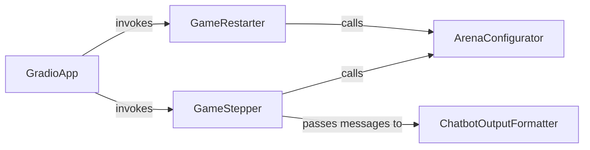

## Details

The `User Interface (Gradio App)` subsystem is responsible for providing a web-based interface for users to interact with, observe, and control the language games. It acts as the presentation layer, translating user actions into commands for the core game logic and displaying game state back to the user.

### GradioApp
Acts as the primary entry point and orchestrator for the Gradio web interface. It initializes the UI layout, sets up event listeners for user interactions (e.g., button clicks for stepping or restarting the game), and manages the overall display of the game state to the user. This component is fundamental as the facade for the entire UI.

**Related Classes/Methods**:

- <a href="https://github.com/Farama-Foundation/chatarena/blob/main/app.py" target="_blank" rel="noopener noreferrer">`app.py`</a>

### GameStepper
Manages the progression of a single turn or step within the language game. It processes user input, triggers the necessary backend game logic (e.g., advancing the `Arena`), and prepares the output for display in the Gradio interface. This component embodies the "step" action, a core interaction in game environments.

**Related Classes/Methods**:

- <a href="https://github.com/Farama-Foundation/chatarena/blob/main/app.py#L378-L449" target="_blank" rel="noopener noreferrer">`app.step_game`:378-449</a>

### GameRestarter
Handles the reinitialization of the game environment, effectively resetting the game to its starting conditions. This includes clearing the UI's chat history and preparing for a new game session. This component manages the lifecycle of a game session from the UI perspective.

**Related Classes/Methods**:

- <a href="https://github.com/Farama-Foundation/chatarena/blob/main/app.py#L451-L470" target="_blank" rel="noopener noreferrer">`app.restart_game`:451-470</a>

### ArenaConfigurator
Constructs and updates the configuration for the game arena based on user selections within the UI. This component acts as a bridge, translating UI inputs (e.g., chosen players, environments, language models) into the structured configuration required by the core `Arena` component (which resides outside this UI subsystem). It's crucial for dynamic game setup.

**Related Classes/Methods**:

- <a href="https://github.com/Farama-Foundation/chatarena/blob/main/app.py#L318-L376" target="_blank" rel="noopener noreferrer">`app._create_arena_config_from_components`:318-376</a>

### ChatbotOutputFormatter
Transforms internal game messages (e.g., `chatarena.message.Message` objects) into a format suitable for display within the Gradio chatbot interface. This ensures a consistent, user-friendly, and visually appealing presentation of agent interactions. This component is vital for the presentation layer's ability to render complex game data.

**Related Classes/Methods**:

- <a href="https://github.com/Farama-Foundation/chatarena/blob/main/app.py#L296-L316" target="_blank" rel="noopener noreferrer">`app._convert_to_chatbot_output`:296-316</a>

### [FAQ](https://github.com/CodeBoarding/GeneratedOnBoardings/tree/main?tab=readme-ov-file#faq)