```mermaid
graph LR
    Arena_Orchestrator["Arena Orchestrator"]
    Agent_Player_Manager["Agent/Player Manager"]
    Game_Environment["Game Environment"]
    Language_Backend_Interface["Language Backend Interface"]
    Configuration_Manager["Configuration Manager"]
    Data_Persistence_Layer["Data Persistence Layer"]
    User_Interface_Gradio_App_["User Interface (Gradio App)"]
    Command_Line_Interface_CLI_["Command Line Interface (CLI)"]
    User_Interface_Gradio_App_ -- "triggers game actions on" --> Arena_Orchestrator
    Command_Line_Interface_CLI_ -- "interacts with" --> Arena_Orchestrator
    Arena_Orchestrator -- "updates game state and retrieves observations from" --> Game_Environment
    Game_Environment -- "provides observations to" --> Arena_Orchestrator
    Arena_Orchestrator -- "requests actions from" --> Agent_Player_Manager
    Agent_Player_Manager -- "sends prompts to and receives responses from" --> Language_Backend_Interface
    Game_Environment -- "provides observations to" --> Agent_Player_Manager
    Configuration_Manager -- "provides initial settings to" --> Arena_Orchestrator
    Configuration_Manager -- "provides initial settings to" --> Agent_Player_Manager
    Configuration_Manager -- "provides initial settings to" --> Game_Environment
    Arena_Orchestrator -- "persists game data to" --> Data_Persistence_Layer
    Data_Persistence_Layer -- "provides loaded messages and state to" --> Arena_Orchestrator
    Game_Environment -- "saves environment-specific data to" --> Data_Persistence_Layer
    Data_Persistence_Layer -- "provides loaded environment state to" --> Game_Environment
    Data_Persistence_Layer -- "provides loaded player configurations to" --> Agent_Player_Manager
    click Arena_Orchestrator href "https://github.com/CodeBoarding/GeneratedOnBoardings/blob/main/chatarena/Arena_Orchestrator.md" "Details"
    click Agent_Player_Manager href "https://github.com/CodeBoarding/GeneratedOnBoardings/blob/main/chatarena/Agent_Player_Manager.md" "Details"
    click Game_Environment href "https://github.com/CodeBoarding/GeneratedOnBoardings/blob/main/chatarena/Game_Environment.md" "Details"
    click Language_Backend_Interface href "https://github.com/CodeBoarding/GeneratedOnBoardings/blob/main/chatarena/Language_Backend_Interface.md" "Details"
    click Configuration_Manager href "https://github.com/CodeBoarding/GeneratedOnBoardings/blob/main/chatarena/Configuration_Manager.md" "Details"
    click Data_Persistence_Layer href "https://github.com/CodeBoarding/GeneratedOnBoardings/blob/main/chatarena/Data_Persistence_Layer.md" "Details"
    click User_Interface_Gradio_App_ href "https://github.com/CodeBoarding/GeneratedOnBoardings/blob/main/chatarena/User_Interface_Gradio_App_.md" "Details"
```

## Details

The `chatarena` project is designed as a highly modular LLM toolkit for multi-agent language game environments. At its core, the `Arena Orchestrator` directs the game flow, coordinating interactions between the `Game Environment`, which defines game rules and state, and the `Agent/Player Manager`, responsible for agent decision-making. Agents communicate with various LLMs through the `Language Backend Interface`. Game state and configurations are managed by the `Data Persistence Layer`, which interacts with both the `Arena Orchestrator` and `Game Environment`. User interaction is facilitated by either the `User Interface (Gradio App)` or the `Command Line Interface (CLI)`, both serving as entry points to the `Arena Orchestrator`. The `Configuration Manager` ensures proper initialization of all key components, enabling a flexible and extensible framework for diverse language game scenarios. This architecture emphasizes clear component boundaries and data flow, making it ideal for visual diagram generation.

### Arena Orchestrator [[Expand]](./Arena_Orchestrator.md)
The central control unit that manages the overall game flow, player turns, and interaction with the environment. It acts as the conductor of the multi-agent language game.

**Related Classes/Methods**:

- <a href="https://github.com/Farama-Foundation/chatarena/blob/main/chatarena/arena.py#L17-L200" target="_blank" rel="noopener noreferrer">`chatarena.arena.Arena`:17-200</a>
- <a href="https://github.com/Farama-Foundation/chatarena/blob/main/chatarena/arena.py" target="_blank" rel="noopener noreferrer">`chatarena.arena.Arena:run`</a>
- <a href="https://github.com/Farama-Foundation/chatarena/blob/main/chatarena/arena.py" target="_blank" rel="noopener noreferrer">`chatarena.arena.Arena:step`</a>

### Agent/Player Manager [[Expand]](./Agent_Player_Manager.md)
Represents the intelligent entities (LLM-driven or human) participating in the game. Each agent is responsible for making decisions and performing actions based on observations.

**Related Classes/Methods**:

- <a href="https://github.com/Farama-Foundation/chatarena/blob/main/chatarena/agent.py#L18-L38" target="_blank" rel="noopener noreferrer">`chatarena.agent.Agent`:18-38</a>
- <a href="https://github.com/Farama-Foundation/chatarena/blob/main/chatarena/agent.py" target="_blank" rel="noopener noreferrer">`chatarena.agent.Agent:act`</a>

### Game Environment [[Expand]](./Game_Environment.md)
Defines the specific rules, state, and dynamics of a language game. It provides observations to agents, processes their actions, and determines game outcomes.

**Related Classes/Methods**:

- <a href="https://github.com/Farama-Foundation/chatarena/blob/main/chatarena/environments/base.py#L28-L187" target="_blank" rel="noopener noreferrer">`chatarena.environments.base.Environment`:28-187</a>
- <a href="https://github.com/Farama-Foundation/chatarena/blob/main/chatarena/environments/base.py" target="_blank" rel="noopener noreferrer">`chatarena.environments.base.Environment:step`</a>
- <a href="https://github.com/Farama-Foundation/chatarena/blob/main/chatarena/environments/base.py" target="_blank" rel="noopener noreferrer">`chatarena.environments.base.Environment:reset`</a>
- <a href="https://github.com/Farama-Foundation/chatarena/blob/main/chatarena/environments/base.py" target="_blank" rel="noopener noreferrer">`chatarena.environments.base.Environment:get_observation`</a>

### Language Backend Interface [[Expand]](./Language_Backend_Interface.md)
Provides a standardized interface for interacting with various Large Language Models (LLMs) and human input. It abstracts away the specifics of different LLM APIs.

**Related Classes/Methods**:

- <a href="https://github.com/Farama-Foundation/chatarena/blob/main/chatarena/backends/base.py" target="_blank" rel="noopener noreferrer">`chatarena.backends.base.Backend`</a>
- <a href="https://github.com/Farama-Foundation/chatarena/blob/main/chatarena/backends/base.py" target="_blank" rel="noopener noreferrer">`chatarena.backends.base.Backend:query`</a>

### Configuration Manager [[Expand]](./Configuration_Manager.md)
Handles the loading, initialization, and saving of various game and system configurations, including environment, agent, and backend settings.

**Related Classes/Methods**:

- <a href="https://github.com/Farama-Foundation/chatarena/blob/main/chatarena/config.py#L122-L136" target="_blank" rel="noopener noreferrer">`chatarena.config.init_config`:122-136</a>

### Data Persistence Layer [[Expand]](./Data_Persistence_Layer.md)
Manages the saving and loading of game states, message histories, and player configurations to a persistent store.

**Related Classes/Methods**:

- <a href="https://github.com/Farama-Foundation/chatarena/blob/main/chatarena/database.py#L37-L45" target="_blank" rel="noopener noreferrer">`chatarena.database.save_arena`:37-45</a>
- <a href="https://github.com/Farama-Foundation/chatarena/blob/main/chatarena/database.py#L95-L120" target="_blank" rel="noopener noreferrer">`chatarena.database.save_messages`:95-120</a>
- <a href="https://github.com/Farama-Foundation/chatarena/blob/main/chatarena/message.py" target="_blank" rel="noopener noreferrer">`chatarena.message.Message`</a>

### User Interface (Gradio App) [[Expand]](./User_Interface_Gradio_App_.md)
Provides a web-based interface for users to interact with, observe, and control the language games. It serves as the presentation layer.

**Related Classes/Methods**:

- <a href="https://github.com/Farama-Foundation/chatarena/blob/main/app.py" target="_blank" rel="noopener noreferrer">`app.py`</a>
- <a href="https://github.com/Farama-Foundation/chatarena/blob/main/app.py#L378-L449" target="_blank" rel="noopener noreferrer">`app.step_game`:378-449</a>
- <a href="https://github.com/Farama-Foundation/chatarena/blob/main/app.py#L451-L470" target="_blank" rel="noopener noreferrer">`app.restart_game`:451-470</a>

### Command Line Interface (CLI)
Provides a text-based interface for interacting with the arena.

**Related Classes/Methods**:

- <a href="https://github.com/Farama-Foundation/chatarena/blob/main/chatarena/ui/cli.py" target="_blank" rel="noopener noreferrer">`chatarena.ui.cli`</a>

### [FAQ](https://github.com/CodeBoarding/GeneratedOnBoardings/tree/main?tab=readme-ov-file#faq)