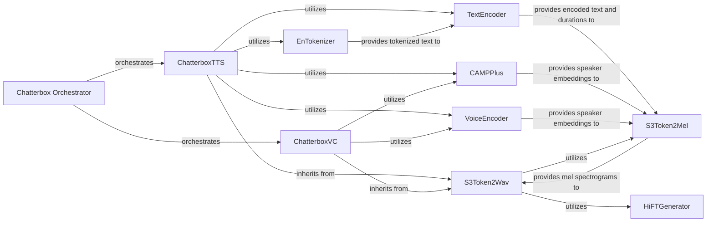

## Component Details

This analysis describes the architecture of the Chatterbox system, detailing its core components for Text-to-Speech (TTS) and Voice Conversion (VC), and their interdependencies.

### Chatterbox Orchestrator
The primary control unit for the entire `chatterbox` system. It serves as the entry point for both Text-to-Speech and Voice Conversion requests, managing the overall workflow from initial user input to the final audio output. It also handles the loading and application of conditional parameters (e.g., speaker identity, style) that guide the synthesis process.

**Related Classes/Methods**:

- `chatterbox` (1:1)

### ChatterboxTTS
The primary Text-to-Speech (TTS) system within chatterbox. It takes input text and optional conditional parameters (e.g., speaker identity) to generate synthesized speech. It integrates various sub-components to perform text tokenization, text encoding, speaker embedding extraction, and ultimately, audio waveform generation.

**Related Classes/Methods**:

- <a href="https://github.com/resemble-ai/chatterbox/blob/master/src/chatterbox/tts.py#L105-L271" target="_blank" rel="noopener noreferrer">`chatterbox.tts.ChatterboxTTS` (105:271)</a>

### ChatterboxVC
The Voice Conversion (VC) component of the chatterbox system. It transforms an input voice into a target voice, leveraging speaker embeddings to achieve the desired vocal characteristics. It reuses the core audio generation pipeline for producing the converted speech.

**Related Classes/Methods**:

- <a href="https://github.com/resemble-ai/chatterbox/blob/master/src/chatterbox/vc.py#L15-L103" target="_blank" rel="noopener noreferrer">`chatterbox.vc.ChatterboxVC` (15:103)</a>

### S3Token2Wav
This component serves as a unified audio generation pipeline, converting S3 tokens (which represent mel spectrograms) into high-fidelity raw audio waveforms. It orchestrates the process by internally leveraging `S3Token2Mel` to generate mel spectrograms and then `HiFTGenerator` to convert these spectrograms into raw audio. It acts as a foundational component for both Text-to-Speech and Voice Conversion functionalities, as both `ChatterboxTTS` and `ChatterboxVC` inherit from it.

**Related Classes/Methods**:

- <a href="https://github.com/resemble-ai/chatterbox/blob/master/src/chatterbox/models/s3gen/s3gen.py#L211-L297" target="_blank" rel="noopener noreferrer">`chatterbox.models.s3gen.s3gen.S3Token2Wav` (211:297)</a>

### S3Token2Mel
A critical intermediate component that orchestrates the generation of mel spectrograms. It integrates encoded text, speaker embeddings, and potentially preprocessed audio tokens to produce mel spectrograms, which are a compact representation of audio frequency content.

**Related Classes/Methods**:

- <a href="https://github.com/resemble-ai/chatterbox/blob/master/src/chatterbox/models/s3gen/s3gen.py#L46-L208" target="_blank" rel="noopener noreferrer">`chatterbox.models.s3gen.s3gen.S3Token2Mel` (46:208)</a>

### HiFTGenerator
A HiFi-GAN based vocoder responsible for converting mel spectrograms into high-fidelity raw audio waveforms. This is the final step in the speech synthesis process, transforming the abstract audio representation into audible sound.

**Related Classes/Methods**:

- <a href="https://github.com/resemble-ai/chatterbox/blob/master/src/chatterbox/models/s3gen/hifigan.py#L285-L473" target="_blank" rel="noopener noreferrer">`chatterbox.models.s3gen.hifigan.HiFTGenerator` (285:473)</a>

### EnTokenizer
Responsible for converting raw English text into a sequence of numerical tokens. This tokenized representation is the initial step in preparing text for neural network processing in the TTS pipeline.

**Related Classes/Methods**:

- <a href="https://github.com/resemble-ai/chatterbox/blob/master/src/chatterbox/models/tokenizers/tokenizer.py#L15-L49" target="_blank" rel="noopener noreferrer">`chatterbox.models.tokenizers.tokenizer.EnTokenizer` (15:49)</a>

### TextEncoder
Processes tokenized text to create a rich, context-aware encoded representation. This component incorporates attention mechanisms and duration prediction, which are crucial for aligning text with speech and generating natural-sounding output.

**Related Classes/Methods**:

- <a href="https://github.com/resemble-ai/chatterbox/blob/master/src/chatterbox/models/s3gen/matcha/text_encoder.py#L330-L412" target="_blank" rel="noopener noreferrer">`chatterbox.models.s3gen.matcha.text_encoder.TextEncoder` (330:412)</a>

### CAMPPlus
An x-vector model used for extracting speaker embeddings from audio. These embeddings capture unique characteristics of a speaker's voice, enabling functionalities like speaker verification, voice cloning, and conditioning speech synthesis on a specific speaker's voice.

**Related Classes/Methods**:

- <a href="https://github.com/resemble-ai/chatterbox/blob/master/src/chatterbox/models/s3gen/xvector.py#L339-L427" target="_blank" rel="noopener noreferrer">`chatterbox.models.s3gen.xvector.CAMPPlus` (339:427)</a>

### VoiceEncoder
Encodes voice inputs (raw audio or mel spectrograms) into compact, meaningful speaker embeddings. These embeddings are vital for tasks requiring voice similarity analysis, voice conversion, and speaker-conditioned speech generation.

**Related Classes/Methods**:

- <a href="https://github.com/resemble-ai/chatterbox/blob/master/src/chatterbox/models/voice_encoder/voice_encoder.py#L118-L273" target="_blank" rel="noopener noreferrer">`chatterbox.models.voice_encoder.voice_encoder.VoiceEncoder` (118:273)</a>

### [FAQ](https://github.com/CodeBoarding/GeneratedOnBoardings/tree/main?tab=readme-ov-file#faq)