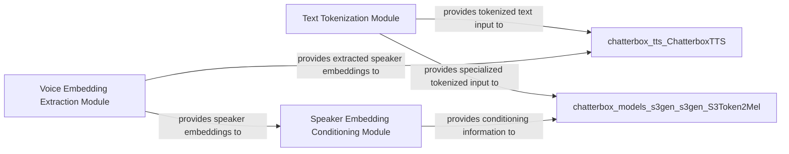

## Component Details

These three components are fundamental to the `Input Preprocessing Unit` because they collectively address the critical initial steps of transforming diverse raw inputs (text and audio) into a standardized, machine-readable format required by the downstream neural network models for speech synthesis and voice conversion.

### Text Tokenization Module
This module handles the conversion of raw input text into a sequence of numerical tokens. It encompasses both a general-purpose English tokenizer and a specialized tokenizer designed to prepare text input specifically for the S3Gen model.

**Related Classes/Methods**:

- `EnTokenizer` (1:1)
- `S3Tokenizer` (1:1)

### Voice Embedding Extraction Module
This module is dedicated to extracting speaker embeddings (e.g., x-vectors) from raw audio voice references. These embeddings are compact numerical representations that capture the unique characteristics and identity of a speaker's voice.

**Related Classes/Methods**:

- <a href="https://github.com/resemble-ai/chatterbox/blob/master/src/chatterbox/models/voice_encoder/voice_encoder.py#L118-L273" target="_blank" rel="noopener noreferrer">`VoiceEncoder` (118:273)</a>

### Speaker Embedding Conditioning Module
This module processes and integrates the speaker embeddings (such as x-vectors) to condition the mel-spectrogram generation process. Its role is to ensure that the synthesized speech accurately reflects the desired speaker's vocal characteristics by influencing the generative model.

**Related Classes/Methods**:

- `CAMPPlus` (1:1)

### [FAQ](https://github.com/CodeBoarding/GeneratedOnBoardings/tree/main?tab=readme-ov-file#faq)