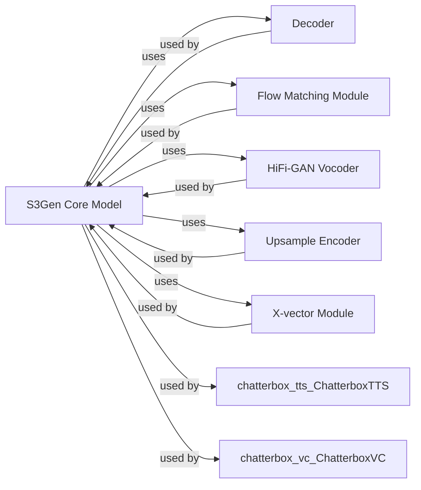

## Component Details

The `S3Gen Acoustic Model` is a sophisticated system designed for generating high-quality mel-spectrograms and, subsequently, raw audio waveforms. It leverages advanced techniques like flow matching and conditional decoding, integrating various specialized modules to achieve its purpose.

### S3Gen Core Model
This is the central orchestrator of the S3Gen acoustic model. It manages the overall process of generating mel-spectrograms (`S3Token2Mel`) from S3 tokens or latent codes and, by integrating a vocoder, converts them into raw audio waveforms (`S3Token2Wav`). It serves as the primary interface for higher-level components like ChatterboxTTS and ChatterboxVC.

**Related Classes/Methods**:

- <a href="https://github.com/resemble-ai/chatterbox/blob/master/src/chatterbox/models/s3gen/s3gen.py#L46-L208" target="_blank" rel="noopener noreferrer">`chatterbox.models.s3gen.s3gen.S3Token2Mel` (46:208)</a>
- <a href="https://github.com/resemble-ai/chatterbox/blob/master/src/chatterbox/models/s3gen/s3gen.py#L211-L297" target="_blank" rel="noopener noreferrer">`chatterbox.models.s3gen.s3gen.S3Token2Wav` (211:297)</a>

### Decoder
This module is responsible for transforming latent representations or processed S3 tokens into mel-spectrograms. It employs conditional decoding mechanisms to guide the generation process based on various input conditions. Key classes like `ConditionalDecoder` and `CausalBlock1D` indicate a sophisticated decoding architecture.

**Related Classes/Methods**:

- <a href="https://github.com/resemble-ai/chatterbox/blob/master/src/chatterbox/models/s3gen/decoder.py#L99-L316" target="_blank" rel="noopener noreferrer">`chatterbox.models.s3gen.decoder.ConditionalDecoder` (99:316)</a>
- <a href="https://github.com/resemble-ai/chatterbox/blob/master/src/chatterbox/models/s3gen/decoder.py#L47-L60" target="_blank" rel="noopener noreferrer">`chatterbox.models.s3gen.decoder.CausalBlock1D` (47:60)</a>

### Flow Matching Module
This component implements advanced flow-matching techniques, such as Conditional Flow Matching (CFM), for robust and high-quality acoustic feature generation. It plays a crucial role in modeling the complex distribution of mel-spectrograms, enabling more natural and expressive speech synthesis. `CausalConditionalCFM` is a key class within this module.

**Related Classes/Methods**:

- <a href="https://github.com/resemble-ai/chatterbox/blob/master/src/chatterbox/models/s3gen/flow_matching.py#L187-L217" target="_blank" rel="noopener noreferrer">`chatterbox.models.s3gen.flow_matching.CausalConditionalCFM` (187:217)</a>

### HiFi-GAN Vocoder
This module is a high-fidelity vocoder that converts the generated mel-spectrograms into audible raw audio waveforms. It is a critical post-processing step, ensuring that the synthesized speech is natural and clear. The `HiFTGenerator` class is central to this functionality.

**Related Classes/Methods**:

- <a href="https://github.com/resemble-ai/chatterbox/blob/master/src/chatterbox/models/s3gen/hifigan.py#L285-L473" target="_blank" rel="noopener noreferrer">`chatterbox.models.s3gen.hifigan.HiFTGenerator` (285:473)</a>

### Upsample Encoder
This transformer-based component is responsible for upsampling or encoding input features to a higher resolution or a richer representation. This processing is crucial for preparing the input data for the mel-spectrogram generation process, ensuring that the acoustic model has sufficient detail to work with. `UpsampleConformerEncoder` is an example of a class within this module.

**Related Classes/Methods**:

- <a href="https://github.com/resemble-ai/chatterbox/blob/master/src/chatterbox/models/s3gen/transformer/upsample_encoder.py#L98-L317" target="_blank" rel="noopener noreferrer">`chatterbox.models.s3gen.transformer.upsample_encoder.UpsampleConformerEncoder` (98:317)</a>

### X-vector Module
This module processes and incorporates speaker-specific information, often in the form of x-vectors, to condition the acoustic model. This conditioning is vital for tasks like voice conversion, where the generated speech needs to match a target speaker's voice characteristics, or for speaker-dependent speech synthesis. `CAMPPlus` is a key class here.

**Related Classes/Methods**:

- <a href="https://github.com/resemble-ai/chatterbox/blob/master/src/chatterbox/models/s3gen/xvector.py#L339-L427" target="_blank" rel="noopener noreferrer">`chatterbox.models.s3gen.xvector.CAMPPlus` (339:427)</a>

### [FAQ](https://github.com/CodeBoarding/GeneratedOnBoardings/tree/main?tab=readme-ov-file#faq)