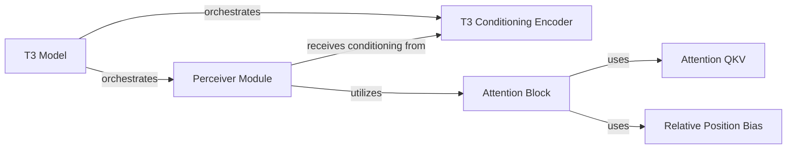

## Component Details

The project's T3 subsystem is designed for generating latent representations, primarily focusing on transforming processed text and conditional inputs into a compact, abstract form. This subsystem is crucial for tasks like speech synthesis, where various inputs need to be distilled into a meaningful, lower-dimensional representation.

### T3 Model
The `T3` class serves as the central orchestrator of the T3 Latent Representation Model. It manages the overall data flow, integrating the conditioning encoder and the Perceiver module to transform processed text and conditional inputs into a compact latent representation. It handles the forward pass, loss computation, and inference, acting as the primary interface for the T3 model's operations.

**Related Classes/Methods**:

- <a href="https://github.com/resemble-ai/chatterbox/blob/master/src/chatterbox/models/t3/t3.py#L30-L370" target="_blank" rel="noopener noreferrer">`src.chatterbox.models.t3.t3.T3` (30:370)</a>

### T3 Conditioning Encoder
The `CondEncoder` module is responsible for processing various conditional inputs (e.g., speaker embeddings, text embeddings) and generating conditioning vectors. These vectors are crucial for guiding the T3 model's generative process, ensuring the latent representation accurately reflects the desired speech characteristics. It provides the necessary contextual information to the main T3 model and the Perceiver module.

**Related Classes/Methods**:

- <a href="https://github.com/resemble-ai/chatterbox/blob/master/src/chatterbox/models/t3/modules/cond_enc.py#L1-L1" target="_blank" rel="noopener noreferrer">`src.chatterbox.models.t3.modules.cond_enc.CondEncoder` (1:1)</a>

### Perceiver Module
The `Perceiver` module is a core architectural component within the T3 model, designed to efficiently process long sequences and extract salient features using attention mechanisms. It receives processed input from the T3 model and conditioning information from the `T3 Conditioning Encoder`, producing the abstract latent representations. It acts as a bottleneck, compressing high-dimensional inputs into a fixed-size latent space.

**Related Classes/Methods**:

- <a href="https://github.com/resemble-ai/chatterbox/blob/master/src/chatterbox/models/t3/modules/perceiver.py#L172-L211" target="_blank" rel="noopener noreferrer">`src.chatterbox.models.t3.modules.perceiver.Perceiver` (172:211)</a>

### Attention Block
The `AttentionBlock` is a fundamental building block within the `Perceiver Module`, encapsulating a self-attention mechanism. It processes input sequences, applies attention, and outputs refined sequences, contributing to the Perceiver's ability to extract relevant features. It utilizes `Attention QKV` for computing attention matrices and `Relative Position Bias` for incorporating positional information.

**Related Classes/Methods**:

- <a href="https://github.com/resemble-ai/chatterbox/blob/master/src/chatterbox/models/s3gen/transformer/attention.py#L1-L1" target="_blank" rel="noopener noreferrer">`src.chatterbox.models.s3gen.transformer.attention.AttentionBlock` (1:1)</a>

### Attention QKV
This component, primarily implemented within the `Attention` class, is responsible for computing the Query, Key, and Value matrices, which are essential for the attention mechanism. It also handles different attention implementations, such as Flash Attention, optimizing the attention computation within the `Attention Block`.

**Related Classes/Methods**:

- <a href="https://github.com/resemble-ai/chatterbox/blob/master/src/chatterbox/models/s3gen/transformer/attention.py#L1-L1" target="_blank" rel="noopener noreferrer">`src.chatterbox.models.s3gen.transformer.attention.Attention` (1:1)</a>

### Relative Position Bias
The `RelativePositionBias` component is used within attention mechanisms to incorporate positional information, enhancing the model's ability to understand sequence order and relationships between elements. It biases the attention scores based on the relative positions of tokens, improving the model's ability to capture sequential dependencies.

**Related Classes/Methods**:

- <a href="https://github.com/resemble-ai/chatterbox/blob/master/src/chatterbox/models/s3gen/transformer/attention.py#L1-L1" target="_blank" rel="noopener noreferrer">`src.chatterbox.models.s3gen.transformer.attention.RelativePositionBias` (1:1)</a>

### [FAQ](https://github.com/CodeBoarding/GeneratedOnBoardings/tree/main?tab=readme-ov-file#faq)