```mermaid
graph LR
    Chatterbox_Orchestrator["Chatterbox Orchestrator"]
    Input_Preprocessing_Unit["Input Preprocessing Unit"]
    T3_Latent_Representation_Model["T3 Latent Representation Model"]
    S3Gen_Acoustic_Model["S3Gen Acoustic Model"]
    Waveform_Synthesizer["Waveform Synthesizer"]
    Chatterbox_Orchestrator -- "Sends input to" --> Input_Preprocessing_Unit
    Chatterbox_Orchestrator -- "Provides conditional parameters to" --> T3_Latent_Representation_Model
    Chatterbox_Orchestrator -- "Provides conditional parameters to" --> S3Gen_Acoustic_Model
    Input_Preprocessing_Unit -- "Provides processed text/voice features to" --> T3_Latent_Representation_Model
    Input_Preprocessing_Unit -- "Provides processed features to" --> S3Gen_Acoustic_Model
    T3_Latent_Representation_Model -- "Provides latent codes to" --> S3Gen_Acoustic_Model
    S3Gen_Acoustic_Model -- "Provides mel-spectrograms to" --> Waveform_Synthesizer
    Waveform_Synthesizer -- "Provides synthesized audio to" --> Chatterbox_Orchestrator
    click Chatterbox_Orchestrator href "https://github.com/CodeBoarding/GeneratedOnBoardings/blob/main//chatterbox/Chatterbox_Orchestrator.md" "Details"
    click Input_Preprocessing_Unit href "https://github.com/CodeBoarding/GeneratedOnBoardings/blob/main//chatterbox/Input_Preprocessing_Unit.md" "Details"
    click T3_Latent_Representation_Model href "https://github.com/CodeBoarding/GeneratedOnBoardings/blob/main//chatterbox/T3_Latent_Representation_Model.md" "Details"
    click S3Gen_Acoustic_Model href "https://github.com/CodeBoarding/GeneratedOnBoardings/blob/main//chatterbox/S3Gen_Acoustic_Model.md" "Details"
```

## Component Details

The `chatterbox` project is designed for advanced Text-to-Speech (TTS) and Voice Conversion (VC) functionalities, leveraging sophisticated deep learning models. The architecture is modular, with distinct components handling input processing, latent representation generation, acoustic modeling, and final waveform synthesis.

### Chatterbox Orchestrator
The primary control unit for the entire `chatterbox` system. It serves as the entry point for both Text-to-Speech and Voice Conversion requests, managing the overall workflow from initial user input to the final audio output. It also handles the loading and application of conditional parameters (e.g., speaker identity, style) that guide the synthesis process.

**Related Classes/Methods**:

- <a href="https://github.com/resemble-ai/chatterbox/blob/master/src/chatterbox/tts.py#L0-L0" target="_blank" rel="noopener noreferrer">`chatterbox.tts` (0:0)</a>
- <a href="https://github.com/resemble-ai/chatterbox/blob/master/src/chatterbox/vc.py#L0-L0" target="_blank" rel="noopener noreferrer">`chatterbox.vc` (0:0)</a>

### Input Preprocessing Unit
This component is responsible for transforming raw input data (text or audio) into a structured format suitable for neural network consumption. It includes functionalities for text tokenization, extraction of speaker embeddings from voice references, and conversion of raw audio into discrete S3 tokens for voice conversion tasks.

**Related Classes/Methods**:

- <a href="https://github.com/resemble-ai/chatterbox/blob/master/src/chatterbox/models/tokenizers/tokenizer.py#L0-L0" target="_blank" rel="noopener noreferrer">`chatterbox.models.tokenizers.tokenizer` (0:0)</a>
- <a href="https://github.com/resemble-ai/chatterbox/blob/master/src/chatterbox/models/s3gen/matcha/text_encoder.py#L0-L0" target="_blank" rel="noopener noreferrer">`chatterbox.models.s3gen.matcha.text_encoder` (0:0)</a>
- <a href="https://github.com/resemble-ai/chatterbox/blob/master/src/chatterbox/models/voice_encoder/voice_encoder.py#L0-L0" target="_blank" rel="noopener noreferrer">`chatterbox.models.voice_encoder.voice_encoder` (0:0)</a>
- <a href="https://github.com/resemble-ai/chatterbox/blob/master/src/chatterbox/models/s3gen/xvector.py#L0-L0" target="_blank" rel="noopener noreferrer">`chatterbox.models.s3gen.xvector` (0:0)</a>
- <a href="https://github.com/resemble-ai/chatterbox/blob/master/src/chatterbox/models/s3tokenizer/s3tokenizer.py#L0-L0" target="_blank" rel="noopener noreferrer">`chatterbox.models.s3tokenizer.s3tokenizer` (0:0)</a>

### T3 Latent Representation Model
A core transformer-based generative model that takes processed text and various conditional inputs (e.g., speaker embeddings) to produce a compact, abstract latent representation. This latent code encapsulates the essential information required for speech synthesis, acting as an intermediate bridge between linguistic input and acoustic features.

**Related Classes/Methods**:

- <a href="https://github.com/resemble-ai/chatterbox/blob/master/src/chatterbox/models/t3/t3.py#L0-L0" target="_blank" rel="noopener noreferrer">`chatterbox.models.t3.t3` (0:0)</a>
- <a href="https://github.com/resemble-ai/chatterbox/blob/master/src/chatterbox/models/t3/modules/perceiver.py#L0-L0" target="_blank" rel="noopener noreferrer">`chatterbox.models.t3.modules.perceiver` (0:0)</a>
- <a href="https://github.com/resemble-ai/chatterbox/blob/master/src/chatterbox/models/t3/modules/cond_enc.py#L0-L0" target="_blank" rel="noopener noreferrer">`chatterbox.models.t3.modules.cond_enc` (0:0)</a>

### S3Gen Acoustic Model
This component is responsible for generating mel-spectrograms, which are a common intermediate acoustic representation of speech. It can synthesize mel-spectrograms from either latent codes provided by the T3 model or directly from S3 tokens (for voice conversion). It incorporates advanced techniques like conditional decoding and flow matching for high-quality acoustic feature generation.

**Related Classes/Methods**:

- <a href="https://github.com/resemble-ai/chatterbox/blob/master/src/chatterbox/models/s3gen/s3gen.py#L0-L0" target="_blank" rel="noopener noreferrer">`chatterbox.models.s3gen.s3gen` (0:0)</a>
- <a href="https://github.com/resemble-ai/chatterbox/blob/master/src/chatterbox/models/s3gen/decoder.py#L0-L0" target="_blank" rel="noopener noreferrer">`chatterbox.models.s3gen.decoder` (0:0)</a>
- <a href="https://github.com/resemble-ai/chatterbox/blob/master/src/chatterbox/models/s3gen/flow_matching.py#L0-L0" target="_blank" rel="noopener noreferrer">`chatterbox.models.s3gen.flow_matching` (0:0)</a>
- <a href="https://github.com/resemble-ai/chatterbox/blob/master/src/chatterbox/models/s3gen/matcha/decoder.py#L0-L0" target="_blank" rel="noopener noreferrer">`chatterbox.models.s3gen.matcha.decoder` (0:0)</a>

### Waveform Synthesizer
The final stage in the audio generation pipeline. This component takes the generated mel-spectrograms and converts them into high-fidelity raw audio waveforms. It primarily utilizes a neural vocoder (e.g., HiFi-GAN) to reconstruct the audible speech signal, ensuring natural-sounding output.

**Related Classes/Methods**:

- <a href="https://github.com/resemble-ai/chatterbox/blob/master/src/chatterbox/models/s3gen/s3gen.py#L0-L0" target="_blank" rel="noopener noreferrer">`chatterbox.models.s3gen.s3gen` (0:0)</a>
- <a href="https://github.com/resemble-ai/chatterbox/blob/master/src/chatterbox/models/s3gen/hifigan.py#L0-L0" target="_blank" rel="noopener noreferrer">`chatterbox.models.s3gen.hifigan` (0:0)</a>

### [FAQ](https://github.com/CodeBoarding/GeneratedOnBoardings/tree/main?tab=readme-ov-file#faq)