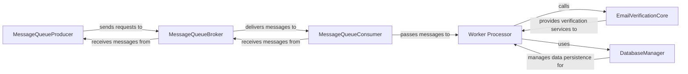

## Details

Abstract Components Overview

### MessageQueueProducer
Responsible for publishing email verification requests as messages to a message queue. It acts as the entry point for asynchronous processing, ensuring requests are queued for later handling.

**Related Classes/Methods**:

- `src/messaging/rabbitmq_producer.rs` (1:1)
- `src/messaging/mod.rs` (1:1)

### MessageQueueConsumer
Dedicated to consuming messages from the message queue. It retrieves queued email verification requests and prepares them for processing by the worker.

**Related Classes/Methods**:

- `src/messaging/sqs_consumer.rs` (1:1)
- `src/messaging/mod.rs` (1:1)

### Worker Processor
The core processing unit of the asynchronous subsystem. It takes consumed messages, invokes the EmailVerificationCore for actual verification, and then uses the DatabaseManager to persist the results.

**Related Classes/Methods**:

- `src/worker/processor.rs` (1:1)
- `src/worker/mod.rs` (1:1)

### MessageQueueBroker
An external system (e.g., AWS SQS, RabbitMQ) that facilitates reliable message delivery between producers and consumers. It ensures messages are stored, routed, and delivered efficiently.

**Related Classes/Methods**: _None_

### EmailVerificationCore
Contains the primary business logic for performing email verification. This component is independent of the asynchronous processing mechanism and can be called by various interfaces.

**Related Classes/Methods**: _None_

### DatabaseManager
Manages all database operations, including storing the results of email verification. It provides an abstraction layer over the underlying database.

**Related Classes/Methods**: _None_

### [FAQ](https://github.com/CodeBoarding/GeneratedOnBoardings/tree/main?tab=readme-ov-file#faq)