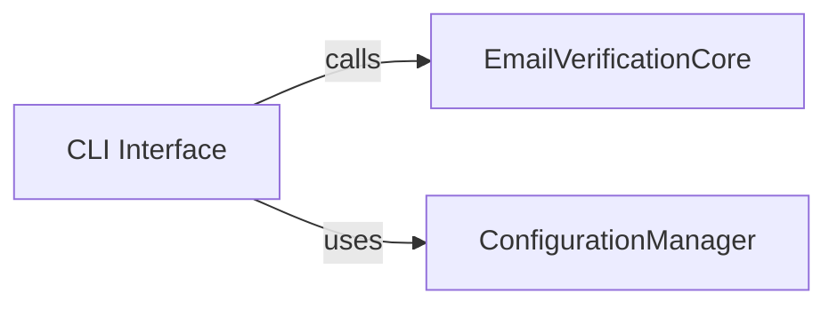

## Details

One paragraph explaining the functionality which is represented by this graph. What the main flow is and what is its purpose.

### CLI Interface [[Expand]](./CLI_Interface.md)
Offers a command-line utility for direct user interaction with the email verification functionality. It parses command-line arguments, orchestrates the verification process by invoking the Email Verification Core, and presents results to the user. It also interacts with the ConfigurationManager to retrieve necessary settings.

**Related Classes/Methods**:

- `src/cli/mod.rs` (1:1)
- `src/cli/main.rs` (1:1)
- `src/cli/commands.rs` (1:1)

### EmailVerificationCore
Core logic for email verification.

**Related Classes/Methods**: _None_

### ConfigurationManager
Manages application settings and configurations.

**Related Classes/Methods**: _None_

### [FAQ](https://github.com/CodeBoarding/GeneratedOnBoardings/tree/main?tab=readme-ov-file#faq)