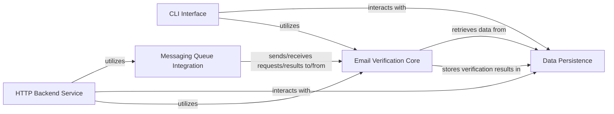

## Details

Abstract Components Overview

### Email Verification Core [[Expand]](./Email_Verification_Core.md)
Encapsulates the primary business logic for email verification, including validation rules, external service calls (if any), and core algorithms. It is the central module providing the core utility.

**Related Classes/Methods**:

- `EmailVerificationCore` (1:1)

### Data Persistence [[Expand]](./Data_Persistence.md)
Handles all interactions with the SQL database. This component is responsible for storing and retrieving verification results, application configurations, and managing database schema changes through integrated migration processes using sqlx.

**Related Classes/Methods**:

- `db.mod` (1:1)
- `db.models` (1:1)
- `db.queries` (1:1)
- `db.migrations` (1:1)

### HTTP Backend Service
Provides a RESTful API or similar HTTP interface for external clients to interact with the email verification utility. It handles request parsing, response formatting, and orchestrates calls to the Email Verification Core and Data Persistence.

**Related Classes/Methods**:

- `HttpBackendService` (1:1)

### CLI Interface [[Expand]](./CLI_Interface.md)
Offers a command-line interface for users to perform email verification directly from the terminal, manage configurations, or trigger specific operations.

**Related Classes/Methods**:

- `CliInterface` (1:1)

### Messaging Queue Integration
Manages asynchronous communication with external messaging systems like AWS SQS or RabbitMQ. This component enables processing of verification requests in a decoupled manner, handling message publishing and consumption.

**Related Classes/Methods**:

- `MessagingQueueIntegration` (1:1)

### [FAQ](https://github.com/CodeBoarding/GeneratedOnBoardings/tree/main?tab=readme-ov-file#faq)