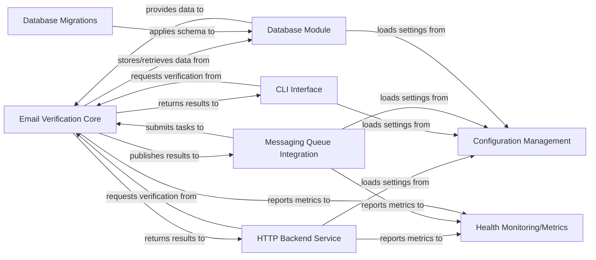

## Details

check-if-email-exists

### Email Verification Core [[Expand]](./Email_Verification_Core.md)
Encapsulates the primary business logic for email validation, including syntax checks, domain validation, MX record lookups, and potentially SMTP connection attempts. It is designed to be independent of any specific interface and serves as the foundational, single source of truth for verification outcomes.

**Related Classes/Methods**:

- `src/core/mod.rs` (1:1)
- `src/core/validator.rs` (1:1)
- `src/core/domain_checker.rs` (1:1)

### HTTP Backend Service
Provides a RESTful API interface for external systems to request email verification. It handles incoming HTTP requests, orchestrates calls to the Email Verification Core, and formats verification results for API responses.

**Related Classes/Methods**:

- `src/backend/mod.rs` (1:1)
- `src/backend/api.rs` (1:1)
- `src/backend/server.rs` (1:1)

### CLI Interface [[Expand]](./CLI_Interface.md)
Offers a command-line interface for users to perform email verification directly from their terminal. It parses command-line arguments, interacts with the Email Verification Core, and displays results to the console.

**Related Classes/Methods**:

- `src/cli/mod.rs` (1:1)
- `src/cli/main.rs` (1:1)

### Messaging Queue Integration
Manages asynchronous communication with message queues (e.g., AWS SQS, RabbitMQ) for processing email verification tasks. It can publish verification requests or results as events and consume tasks for background processing by the Email Verification Core.

**Related Classes/Methods**:

- `src/mq/mod.rs` (1:1)
- `src/mq/consumer.rs` (1:1)
- `src/mq/publisher.rs` (1:1)

### Database Module
Provides an abstraction layer for database interactions, handling data storage and retrieval for verification results, configuration, or other persistent data. It utilizes sqlx for robust database operations.

**Related Classes/Methods**:

- `src/db/mod.rs` (1:1)
- `src/db/models.rs` (1:1)
- `src/db/schema.rs` (1:1)

### Database Migrations
Contains scripts and logic for managing database schema changes over time. It ensures compatibility and smooth updates across different versions of the application's database schema.

**Related Classes/Methods**:

- `migrations/` (1:1)

### Configuration Management
Manages application-wide settings and environment-specific configurations, such as database connection strings, API keys, and message queue credentials, providing a centralized and flexible way to manage application parameters.

**Related Classes/Methods**:

- `src/config/mod.rs` (1:1)
- `src/config/settings.rs` (1:1)

### Health Monitoring/Metrics
Collects and exposes metrics related to application performance, availability, and error rates. This component enables operational insights and facilitates proactive monitoring of the service's health and efficiency.

**Related Classes/Methods**:

- `src/metrics/mod.rs` (1:1)
- `src/metrics/collector.rs` (1:1)

### [FAQ](https://github.com/CodeBoarding/GeneratedOnBoardings/tree/main?tab=readme-ov-file#faq)