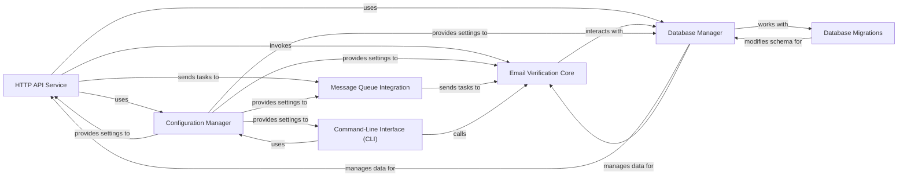

## Details

Component overview for the check-if-email-exists project

### HTTP API Service [[Expand]](./HTTP_API_Service.md)
Provides a RESTful interface for external applications to request email verification. This component is responsible for handling incoming HTTP requests, parsing input, invoking the Email Verification Core for validation, and formatting appropriate responses. It can also offload tasks to the asynchronous processing system.

**Related Classes/Methods**:

- `src/api/mod.rs` (1:1)
- `src/api/routes.rs` (1:1)
- `src/api/handlers.rs` (1:1)

### Email Verification Core [[Expand]](./Email_Verification_Core.md)
Encapsulates the primary business logic for email validation, including syntax checks, domain resolution, and potentially more advanced verification techniques. It is designed to be independent of specific interfaces, ensuring reusability.

**Related Classes/Methods**:

- `src/core/mod.rs` (1:1)
- `src/core/validation.rs` (1:1)

### Configuration Manager
Responsible for loading, parsing, and providing access to application-wide configuration settings, such as database connection strings, API keys, and service-specific parameters.

**Related Classes/Methods**:

- `src/config/mod.rs` (1:1)

### Database Manager
Manages all interactions with the underlying SQL database, including connection pooling, executing queries, and handling data persistence and retrieval for verification results, user data, or cached information.

**Related Classes/Methods**:

- `src/database/mod.rs` (1:1)
- `src/database/models.rs` (1:1)
- `src/database/queries.rs` (1:1)

### Message Queue Integration
Handles the sending and receiving of messages to and from message queues (e.g., AWS SQS, RabbitMQ). This enables asynchronous processing of email verification requests, offloading long-running tasks from the main API thread and facilitating event-driven workflows.

**Related Classes/Methods**:

- `src/messaging/mod.rs` (1:1)
- `src/messaging/producer.rs` (1:1)
- `src/messaging/consumer.rs` (1:1)

### Command-Line Interface (CLI)
Provides a command-line interface for direct interaction with the email verification utility, allowing for batch processing, testing, or administrative tasks without relying on the HTTP API.

**Related Classes/Methods**:

- `src/cli/mod.rs` (1:1)
- `src/main.rs` (1:1)

### Database Migrations
Manages the evolution of the database schema over time, ensuring that database changes are applied in a controlled, versioned, and repeatable manner.

**Related Classes/Methods**:

- `migrations/` (1:1)
- `src/db_migrations/mod.rs` (1:1)

### [FAQ](https://github.com/CodeBoarding/GeneratedOnBoardings/tree/main?tab=readme-ov-file#faq)