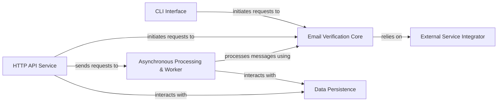

## Details

The `check-if-email-exists` project is designed as a multi-faceted email verification utility, adopting a layered and service-oriented architecture to provide robust and scalable email validation. At its core, the `Email Verification Core` encapsulates the primary business logic for email validation, independent of any specific interface. This core logic is exposed through multiple entry points: an `HTTP API Service` for external applications and a `CLI Interface` for direct user interaction. For operations requiring asynchronous processing, such as bulk verification, the `HTTP API Service` can offload tasks to the `Asynchronous Processing & Worker` component, which consumes messages from queues, processes them using the `Email Verification Core`, and persists results. All persistent data, including verification outcomes and configurations, are managed by the `Data Persistence` component, which also handles database migrations. The `Email Verification Core` relies on the `External Service Integrator` to perform necessary external lookups like DNS MX record resolution and SMTP checks, ensuring comprehensive validation. This modular design promotes reusability, maintainability, and allows for flexible deployment scenarios.

### Email Verification Core [[Expand]](./Email_Verification_Core.md)
Encapsulates the primary business logic for email validation, including syntax checks, domain validation, MX record lookups, and potentially SMTP connection attempts. It is designed to be independent of any specific interface.

**Related Classes/Methods**:

- `src/core/mod.rs` (1:1)
- `src/core/validator.rs` (1:1)
- `src/core/domain_checker.rs` (1:1)

### HTTP API Service [[Expand]](./HTTP_API_Service.md)
Provides a RESTful interface for external applications to request email verification. This component is responsible for handling incoming HTTP requests, parsing input, invoking the Email Verification Core for validation, and formatting appropriate responses. It can also offload tasks to the asynchronous processing system.

**Related Classes/Methods**:

- `src/api/mod.rs` (1:1)
- `src/api/routes.rs` (1:1)
- `src/api/handlers.rs` (1:1)

### CLI Interface [[Expand]](./CLI_Interface.md)
Offers a command-line utility for direct user interaction with the email verification functionality. It parses command-line arguments, orchestrates the verification process by invoking the Email Verification Core, and presents results to the user.

**Related Classes/Methods**:

- `src/cli/mod.rs` (1:1)
- `src/cli/main.rs` (1:1)
- `src/cli/commands.rs` (1:1)

### Asynchronous Processing & Worker [[Expand]](./Asynchronous_Processing_Worker.md)
Manages asynchronous communication and background processing of email verification requests. This includes integrating with message queues (AWS SQS, RabbitMQ) to produce and consume messages, and then processing these messages using the Email Verification Core for bulk verification or deferred tasks.

**Related Classes/Methods**:

- `src/messaging/mod.rs` (1:1)
- `src/messaging/sqs_consumer.rs` (1:1)
- `src/messaging/rabbitmq_producer.rs` (1:1)
- `src/worker/mod.rs` (1:1)
- `src/worker/processor.rs` (1:1)

### Data Persistence [[Expand]](./Data_Persistence.md)
Handles all interactions with the SQL database. This component is responsible for storing and retrieving verification results, application configurations, and managing database schema changes through integrated migration processes using `sqlx`.

**Related Classes/Methods**:

- `src/db/mod.rs` (1:1)
- `src/db/models.rs` (1:1)
- `src/db/queries.rs` (1:1)
- `src/db/migrations.rs` (1:1)

### External Service Integrator [[Expand]](./External_Service_Integrator.md)
Abstracts and manages interactions with external services critical for email verification. This includes performing DNS lookups for MX records and potentially direct SMTP server communication for deliverability checks.

**Related Classes/Methods**:

- `src/external/mod.rs` (1:1)
- `src/external/dns_resolver.rs` (1:1)
- `src/external/smtp_checker.rs` (1:1)

### [FAQ](https://github.com/CodeBoarding/GeneratedOnBoardings/tree/main?tab=readme-ov-file#faq)