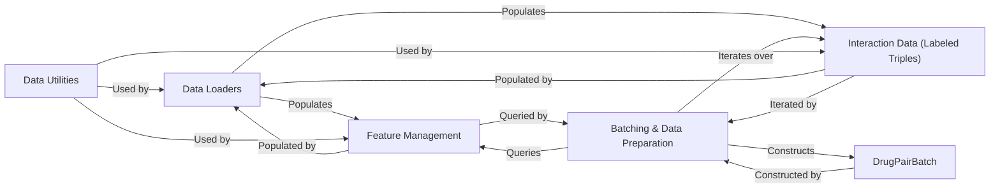

## Details

Final Component Overview for Data Management & Preparation within the chemicalx project

### Data Loaders
This component is the primary interface for acquiring raw chemical and biological datasets. It abstracts the complexities of fetching data from various sources (remote or local) and specific public datasets. It's responsible for populating the initial `DrugFeatureSet`, `ContextFeatureSet`, and `LabeledTriples` objects. This aligns with the "Data Loaders" pattern, providing a unified API for diverse data sources.

**Related Classes/Methods**:

- <a href="https://github.com/AstraZeneca/chemicalx/blob/main/chemicalx/data/datasetloader.py#L1-L1" target="_blank" rel="noopener noreferrer">`chemicalx.data.datasetloader` (1:1)</a>

### Feature Management
This component defines and manages the structured representation of chemical features for drugs (`DrugFeatureSet`) and contextual information (`ContextFeatureSet`). These classes encapsulate the feature data, ensuring consistency and providing methods for accessing and manipulating them. They serve as the organized repositories for all input features required by the models. This aligns with "Feature Processors" and "Datasets" patterns.

**Related Classes/Methods**:

- <a href="https://github.com/AstraZeneca/chemicalx/blob/main/chemicalx/data/drugfeatureset.py#L1-L1" target="_blank" rel="noopener noreferrer">`chemicalx.data.drugfeatureset` (1:1)</a>
- <a href="https://github.com/AstraZeneca/chemicalx/blob/main/chemicalx/data/contextfeatureset.py#L1-L1" target="_blank" rel="noopener noreferrer">`chemicalx.data.contextfeatureset` (1:1)</a>

### Interaction Data (Labeled Triples)
This component represents the core interaction data, typically in the form of (drug1, drug2, label) tuples. It provides functionalities for managing these triples, such as splitting data into training and testing sets, and querying counts of positive/negative interactions. It is the ground truth dataset for model training and evaluation. This is a fundamental "Dataset" component.

**Related Classes/Methods**:

- <a href="https://github.com/AstraZeneca/chemicalx/blob/main/chemicalx/data/labeledtriples.py#L1-L1" target="_blank" rel="noopener noreferrer">`chemicalx.data.labeledtriples` (1:1)</a>

### Batching & Data Preparation
This component is responsible for transforming the raw feature sets and labeled triples into optimized mini-batches (`DrugPairBatch`) suitable for efficient consumption by deep learning models. It iterates through the interaction data, retrieves corresponding features, and constructs the final batch objects. This is a critical part of the "Training Pipeline" and "Data Preprocessing Scripts".

**Related Classes/Methods**:

- <a href="https://github.com/AstraZeneca/chemicalx/blob/main/chemicalx/data/batchgenerator.py#L1-L1" target="_blank" rel="noopener noreferrer">`chemicalx.data.batchgenerator` (1:1)</a>

### DrugPairBatch
This is a specialized data structure designed to hold a single mini-batch of drug pair interaction data, including drug features, context features, and labels, in a format optimized for PyTorch models. It acts as the standardized input for the deep learning models, ensuring efficient data flow during training and inference. This is a key "Data Structure" component.

**Related Classes/Methods**:

- <a href="https://github.com/AstraZeneca/chemicalx/blob/main/chemicalx/data/drugpairbatch.py#L1-L1" target="_blank" rel="noopener noreferrer">`chemicalx.data.drugpairbatch` (1:1)</a>

### Data Utilities
This component provides a collection of general helper functions for common data-related tasks, such as writing data to JSON files or extracting features. These utilities support the overall data preparation and management processes, promoting code reusability and simplifying various data handling operations across the subsystem.

**Related Classes/Methods**:

- <a href="https://github.com/AstraZeneca/chemicalx/blob/main/chemicalx/data/utils.py#L1-L1" target="_blank" rel="noopener noreferrer">`chemicalx.data.utils` (1:1)</a>

### [FAQ](https://github.com/CodeBoarding/GeneratedOnBoardings/tree/main?tab=readme-ov-file#faq)