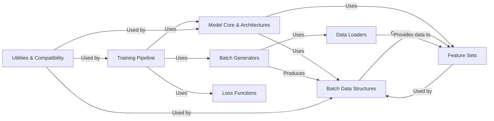

## Details

One paragraph explaining the functionality which is represented by this graph. What the main flow is and what is its purpose.

### Model Core & Architectures [[Expand]](./Model_Core_Architectures.md)
This component defines the foundational abstract interface (`chemicalx.models.base.Model`) for all deep learning models within the library. It also includes the concrete implementations of various high-level model architectures (e.g., `CASTER`, `DeepDDI`, `MHCADDI`, `GCNBMP`, `SSIDDI`) tailored for specific tasks like drug-drug interaction or synergy prediction, encapsulating their overall neural network designs. This component directly aligns with the "Deep Learning Models (Base and Specific Architectures)" pattern, providing a clear and extensible structure for adding new models.

**Related Classes/Methods**:

- `Model Core & Architectures` (1:1)

### Data Loaders
Responsible for loading raw datasets from various sources (local files, remote repositories). This component is crucial as it's the entry point for all data into the system, aligning with the "Data Access Layer" and "Data Loaders" patterns.

**Related Classes/Methods**:

- `Data Loaders` (1:1)

### Feature Sets
Manages and provides the specific features (e.g., drug features, context features) required by the deep learning models. This aligns with "Feature Processors" and is vital for preparing data in a model-consumable format.

**Related Classes/Methods**:

- `Feature Sets` (1:1)

### Batch Data Structures
Defines the structure for mini-batches of data passed to the models during training and inference. This includes drug pairs, features, and labels. It's fundamental for efficient deep learning training.

**Related Classes/Methods**:

- `Batch Data Structures` (1:1)

### Batch Generators
Iterates over datasets and constructs mini-batches of data, often handling shuffling and parallelism. This component bridges the gap between raw data and model-ready inputs.

**Related Classes/Methods**:

- `Batch Generators` (1:1)

### Training Pipeline
Orchestrates the entire training and evaluation process, including iterating over epochs, calling models, calculating loss, and performing optimization steps. This embodies the "Pipeline Pattern" and is the control center for model training.

**Related Classes/Methods**:

- `Training Pipeline` (1:1)

### Loss Functions
Provides various loss functions (e.g., binary cross-entropy) used to quantify the error of model predictions during training. Essential for guiding the model's learning process.

**Related Classes/Methods**:

- `Loss Functions` (1:1)

### Utilities & Compatibility
A collection of helper functions, constants, and compatibility layers (like `PackedGraph` for graph data) that support various parts of the library. While not a single "pattern," these are fundamental for code reusability and handling specific data structures.

**Related Classes/Methods**:

- `Utilities & Compatibility` (1:1)

### [FAQ](https://github.com/CodeBoarding/GeneratedOnBoardings/tree/main?tab=readme-ov-file#faq)