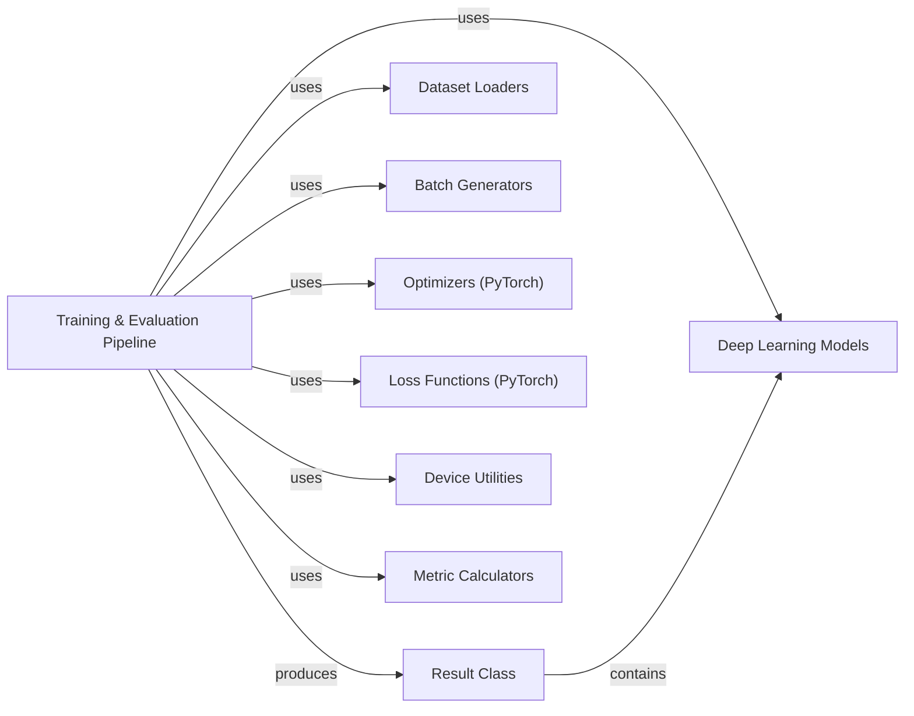

## Details

The `Training & Evaluation Pipeline` component in `chemicalx` is the central orchestrator for deep learning experiments, managing the entire lifecycle from data preparation to model evaluation. It embodies the Pipeline architectural pattern, ensuring a structured and reproducible approach to model training and assessment. This modular design promotes reusability and extensibility, aligning with the project's architectural bias.

### Training & Evaluation Pipeline [[Expand]](./Training_Evaluation_Pipeline.md)
This is the core orchestrator (`chemicalx.pipeline.pipeline`) that manages the end-to-end workflow for training, validating, and evaluating deep learning models. It initializes datasets, models, optimizers, and loss functions, then executes the training loop, handles device placement, and performs model evaluation, finally packaging all results.

**Related Classes/Methods**:

- <a href="https://github.com/AstraZeneca/chemicalx/blob/main/chemicalx/pipeline.py#L72-L201" target="_blank" rel="noopener noreferrer">`chemicalx.pipeline.pipeline` (72:201)</a>

### Result Class
The `Result` class (`chemicalx.pipeline.Result`) acts as a structured container for all outputs and metadata generated by a pipeline run. It encapsulates the trained model, predictions, losses, training/evaluation times, and calculated metrics, providing utility methods for summarization and persistence of experimental outcomes.

**Related Classes/Methods**:

- <a href="https://github.com/AstraZeneca/chemicalx/blob/main/chemicalx/pipeline.py#L36-L69" target="_blank" rel="noopener noreferrer">`chemicalx.pipeline.Result` (36:69)</a>

### Dataset Loaders
This component (`chemicalx.data.datasetloader`) is responsible for loading and preparing raw datasets. It abstracts the process of accessing different data sources (e.g., DrugComb, DrugbankDDI) and provides the necessary data structures for the pipeline.

**Related Classes/Methods**:

- <a href="https://github.com/AstraZeneca/chemicalx/blob/main/chemicalx/data/datasetloader.py" target="_blank" rel="noopener noreferrer">`chemicalx.data.datasetloader`</a>

### Batch Generators
The `BatchGenerator` component (`chemicalx.data.batchgenerator`) is responsible for iterating over the loaded data in mini-batches. It prepares the data in a format suitable for model input, including handling context features, drug features, and drug molecules.

**Related Classes/Methods**:

- <a href="https://github.com/AstraZeneca/chemicalx/blob/main/chemicalx/data/batchgenerator.py" target="_blank" rel="noopener noreferrer">`chemicalx.data.batchgenerator`</a>

### Deep Learning Models
This component (`chemicalx.models.base.Model` and its subclasses like `CASTER`, `DeepDDI`, etc.) represents the various deep learning architectures used for training and inference. These models define the forward pass and are the primary entities being optimized by the pipeline.

**Related Classes/Methods**:

- <a href="https://github.com/AstraZeneca/chemicalx/blob/main/chemicalx/models/base.py#L22-L32" target="_blank" rel="noopener noreferrer">`chemicalx.models.base.Model` (22:32)</a>

### Optimizers (PyTorch)
This component, leveraging PyTorch's `torch.optim` module, is responsible for updating the parameters of the deep learning model during training based on the calculated gradients of the loss function.

**Related Classes/Methods**:

- `torch.optim`

### Loss Functions (PyTorch)
This component, utilizing PyTorch's `torch.nn` module, quantifies the discrepancy between the model's predictions and the actual target values. The calculated loss is then used by the optimizer to adjust model parameters.

**Related Classes/Methods**:

- `torch.nn`

### Device Utilities
The `resolve_device` utility (`chemicalx.utils.resolve_device`) handles the placement of models and data onto the appropriate computing device (CPU or GPU), ensuring efficient execution of deep learning operations.

**Related Classes/Methods**:

- <a href="https://github.com/AstraZeneca/chemicalx/blob/main/chemicalx/utils.py#L66-L82" target="_blank" rel="noopener noreferrer">`chemicalx.utils.resolve_device` (66:82)</a>

### Metric Calculators
This component, primarily using functions from `sklearn.metrics` (e.g., `roc_auc_score`), is responsible for computing various evaluation metrics to assess the performance of the trained model on the test set.

**Related Classes/Methods**:

- `sklearn.metrics`

### [FAQ](https://github.com/CodeBoarding/GeneratedOnBoardings/tree/main?tab=readme-ov-file#faq)