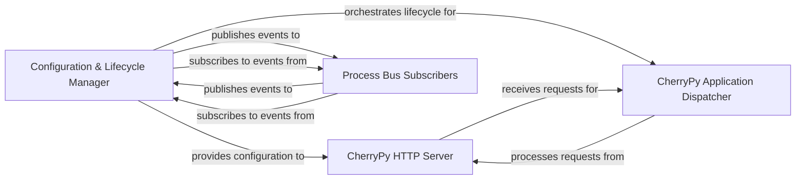

## Details

The CherryPy core architecture is centered around the `Configuration & Lifecycle Manager`, which acts as the central orchestrator for the application. This manager is responsible for loading and applying configuration settings across various parts of the system, particularly providing essential configurations to the `CherryPy HTTP Server`. Concurrently, it meticulously manages the lifecycle of the `CherryPy Application Dispatcher`, ensuring proper startup, shutdown, and graceful handling of the application's operational states. A critical aspect of its design is the robust publish-subscribe mechanism, facilitated by an internal bus, through which it publishes events to and subscribes to events from various `Process Bus Subscribers`. This event-driven communication enables dynamic interaction and coordination among different components, ensuring a cohesive and responsive application environment.

### Configuration & Lifecycle Manager
This central component is responsible for the comprehensive management of application configuration, including loading, parsing, merging, and applying settings across the server and various application parts. Concurrently, it orchestrates the CherryPy application's lifecycle events (e.g., start, stop, exit, graceful shutdown) and facilitates inter-component communication through a robust publish-subscribe mechanism. It also manages process execution and restarts, ensuring the application's stability and responsiveness to configuration changes and operational commands.

**Related Classes/Methods**:

- <a href="https://github.com/cherrypy/cherrypy/blob/main/cherrypy/_cpconfig.py" target="_blank" rel="noopener noreferrer">`cherrypy._cpconfig`</a>
- <a href="https://github.com/cherrypy/cherrypy/blob/main/cherrypy/process/wspbus.py" target="_blank" rel="noopener noreferrer">`cherrypy.process.wspbus`</a>

### CherryPy HTTP Server
This component is responsible for handling HTTP requests and serving the CherryPy application. It receives configuration from the `Configuration & Lifecycle Manager` to set up server parameters such as ports, hostnames, and SSL settings. It acts as the entry point for external client requests and dispatches them to the appropriate application handlers.

**Related Classes/Methods**:

- <a href="https://github.com/cherrypy/cherrypy/blob/main/cherrypy/_cpserver.py" target="_blank" rel="noopener noreferrer">`cherrypy._cpserver`</a>

### CherryPy Application Dispatcher
This component represents the core of the user's CherryPy application logic. It is responsible for mapping incoming HTTP requests to the appropriate Python objects and methods (controllers) that handle the business logic. Its lifecycle, including mounting and unmounting applications, is managed by the `Configuration & Lifecycle Manager`.

**Related Classes/Methods**:

- <a href="https://github.com/cherrypy/cherrypy/blob/main/cherrypy/_cptree.py" target="_blank" rel="noopener noreferrer">`cherrypy._cptree`</a>
- <a href="https://github.com/cherrypy/cherrypy/blob/main/cherrypy/_cpdispatch.py" target="_blank" rel="noopener noreferrer">`cherrypy._cpdispatch`</a>

### Process Bus Subscribers
This component represents various internal CherryPy modules and user-defined plugins that interact with the central publish-subscribe bus. These subscribers listen for specific events published by the `Configuration & Lifecycle Manager` (e.g., server start, stop, configuration reload) and can also publish their own events to influence the application's behavior or communicate with other components.

**Related Classes/Methods**:

- <a href="https://github.com/cherrypy/cherrypy/blob/main/cherrypy/process/plugins.py" target="_blank" rel="noopener noreferrer">`cherrypy.process.plugins`</a>

### [FAQ](https://github.com/CodeBoarding/GeneratedOnBoardings/tree/main?tab=readme-ov-file#faq)