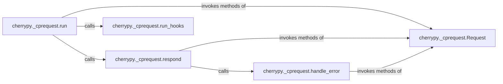

## Details

The `Request/Response Handling` subsystem is a core part of the CherryPy web framework, responsible for managing the entire lifecycle of an HTTP request and generating the corresponding HTTP response.

### cherrypy._cprequest.Request
The central object representing the current HTTP request and its associated response. It acts as a container for all request-specific data and state, aligning with the "Request/Response Objects" pattern.

**Related Classes/Methods**:

- <a href="https://github.com/cherrypy/cherrypy/blob/main/cherrypy/_cprequest.py#L212-L847" target="_blank" rel="noopener noreferrer">`cherrypy._cprequest.Request`:212-847</a>

### cherrypy._cprequest.run
The primary orchestrator of the request lifecycle, driving the request through various stages, including hook execution and response generation. This aligns with the "Request Dispatcher/Router" and "Application/Server Core" patterns.

**Related Classes/Methods**:

- <a href="https://github.com/cherrypy/cherrypy/blob/main/cherrypy/_cprequest.py#L570-L678" target="_blank" rel="noopener noreferrer">`cherrypy._cprequest.run`:570-678</a>

### cherrypy._cprequest.respond
Manages the overall process of generating and sending the HTTP response, including error handling and finalization. This is a key part of the "Request/Response Objects" and "Application/Server Core" in terms of response generation.

**Related Classes/Methods**:

- <a href="https://github.com/cherrypy/cherrypy/blob/main/cherrypy/_cprequest.py#L680-L703" target="_blank" rel="noopener noreferrer">`cherrypy._cprequest.respond`:680-703</a>

### cherrypy._cprequest.run_hooks
Manages and executes the various hooks registered for different stages of the request lifecycle, allowing for custom logic injection. This is a key extensibility point, aligning with the "Extensibility" architectural bias.

**Related Classes/Methods**:

- <a href="https://github.com/cherrypy/cherrypy/blob/main/cherrypy/_cprequest.py#L111-L138" target="_blank" rel="noopener noreferrer">`cherrypy._cprequest.run_hooks`:111-138</a>

### cherrypy._cprequest.handle_error
Specifically deals with exceptions and errors that occur during request processing, ensuring a proper error response is generated. This aligns with the "Error Handling" expected component.

**Related Classes/Methods**:

- <a href="https://github.com/cherrypy/cherrypy/blob/main/cherrypy/_cprequest.py#L833-L847" target="_blank" rel="noopener noreferrer">`cherrypy._cprequest.handle_error`:833-847</a>

### [FAQ](https://github.com/CodeBoarding/GeneratedOnBoardings/tree/main?tab=readme-ov-file#faq)