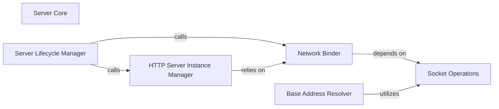

## Details

The `Server Core` subsystem in CherryPy is primarily encapsulated within the `cherrypy._cpserver` module. This subsystem is responsible for the fundamental operations of the HTTP server, including its startup, network binding, and management of the underlying server instance.

### Server Core [[Expand]](./Server_Core.md)
The overarching component that manages the entire lifecycle of the HTTP server, from startup to binding and ensuring the server's availability. It acts as the primary entry point for incoming requests.

**Related Classes/Methods**:

- <a href="https://github.com/cherrypy/cherrypy/blob/main/cherrypy/_cpserver.py" target="_blank" rel="noopener noreferrer">`cherrypy._cpserver`</a>

### Server Lifecycle Manager
Orchestrates the initiation of the HTTP server's lifecycle. It coordinates the binding of network addresses and the creation/retrieval of the HTTP server instance, acting as the primary method for starting the server.

**Related Classes/Methods**:

- <a href="https://github.com/cherrypy/cherrypy/blob/main/cherrypy/_cpserver.py#L190-L194" target="_blank" rel="noopener noreferrer">`cherrypy._cpserver.start`:190-194</a>

### HTTP Server Instance Manager
Manages the creation or retrieval of the underlying HTTP server object, ensuring a proper server instance is available for handling requests. It abstracts the details of the specific HTTP server implementation.

**Related Classes/Methods**:

- <a href="https://github.com/cherrypy/cherrypy/blob/main/cherrypy/_cpserver.py#L177-L188" target="_blank" rel="noopener noreferrer">`cherrypy._cpserver.httpserver_from_self`:177-188</a>

### Network Binder
Handles the crucial task of binding the server to a specific network address (host and port). This component is responsible for making the server accessible over the network by listening for incoming connections.

**Related Classes/Methods**:

- <a href="https://github.com/cherrypy/cherrypy/blob/main/cherrypy/_cpserver.py#L211-L230" target="_blank" rel="noopener noreferrer">`cherrypy._cpserver.bind_addr`:211-230</a>

### Socket Operations
Provides low-level, core socket-related functionalities. It acts as a utility component for network interactions, abstracting the complexities of raw socket operations required for network binding.

**Related Classes/Methods**:

- <a href="https://github.com/cherrypy/cherrypy/blob/main/cherrypy/_cpserver.py#L41-L49" target="_blank" rel="noopener noreferrer">`cherrypy._cpserver.socket_host`:41-49</a>

### Base Address Resolver
Deals with base address resolution or configuration aspects related to the server's network presence and setup, potentially influencing how the server's root URL is determined or handled.

**Related Classes/Methods**:

- <a href="https://github.com/cherrypy/cherrypy/blob/main/cherrypy/_cpserver.py#L232-L260" target="_blank" rel="noopener noreferrer">`cherrypy._cpserver.base`:232-260</a>

### [FAQ](https://github.com/CodeBoarding/GeneratedOnBoardings/tree/main?tab=readme-ov-file#faq)