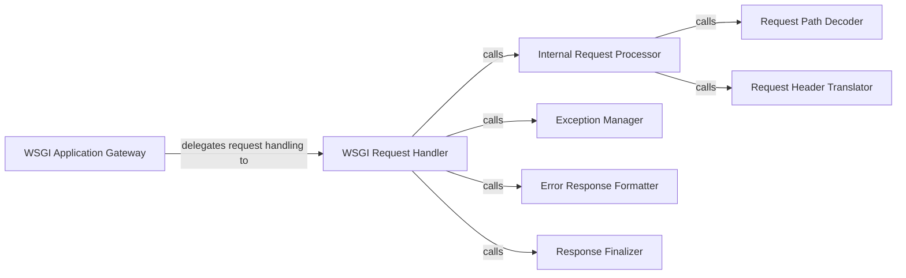

## Details

The WSGI Gateway subsystem in CherryPy, primarily encapsulated within cherrypy._cpwsgi, serves as the critical interface between any WSGI-compliant web server and the CherryPy application. It translates standard WSGI environments into CherryPy's internal request/response model, orchestrating the entire request-response lifecycle.

### WSGI Application Gateway
The top-level class representing the WSGI application itself. It acts as the main entry point for all WSGI requests, delegating the actual request handling.

**Related Classes/Methods**:

- <a href="https://github.com/cherrypy/cherrypy/blob/main/cherrypy/_cpwsgi.py" target="_blank" rel="noopener noreferrer">`cherrypy._cpwsgi`</a>

### WSGI Request Handler
The actual WSGI application entry point, invoked by the WSGI server for each request. It orchestrates the request processing by delegating to other internal methods for execution, error handling, and finalization.

**Related Classes/Methods**:

- <a href="https://github.com/cherrypy/cherrypy/blob/main/cherrypy/_cpwsgi.py#L462-L473" target="_blank" rel="noopener noreferrer">`cherrypy._cpwsgi.__call__`:462-473</a>

### Internal Request Processor
Encapsulates the core logic for processing a single WSGI request. It's responsible for translating the raw WSGI environment into CherryPy's internal request format and initiating the dispatch to the appropriate CherryPy handler.

**Related Classes/Methods**:

- <a href="https://github.com/cherrypy/cherrypy/blob/main/cherrypy/_cpwsgi.py#L324-L364" target="_blank" rel="noopener noreferrer">`cherrypy._cpwsgi.run`:324-364</a>

### Exception Manager
A crucial component for centralized error trapping and exception handling throughout the request-response cycle, ensuring graceful error management and consistent error responses.

**Related Classes/Methods**:

- <a href="https://github.com/cherrypy/cherrypy/blob/main/cherrypy/_cpwsgi.py#L206-L246" target="_blank" rel="noopener noreferrer">`cherrypy._cpwsgi.trap`:206-246</a>

### Error Response Formatter
A specialized component responsible for handling and formatting responses, particularly in scenarios where error trapping is integrated. It ensures that error responses conform to expected patterns.

**Related Classes/Methods**:

- <a href="https://github.com/cherrypy/cherrypy/blob/main/cherrypy/_cpwsgi.py#L179-L246" target="_blank" rel="noopener noreferrer">`cherrypy._cpwsgi._TrappedResponse`:179-246</a>

### Request Path Decoder
Handles the decoding and normalization of the request path and query string from the WSGI environment, preparing them for internal routing and processing.

**Related Classes/Methods**:

- <a href="https://github.com/cherrypy/cherrypy/blob/main/cherrypy/_cpwsgi.py#L374-L399" target="_blank" rel="noopener noreferrer">`cherrypy._cpwsgi.recode_path_qs`:374-399</a>

### Request Header Translator
Responsible for converting WSGI environment headers into CherryPy's internal header format, making them accessible and usable by the application.

**Related Classes/Methods**:

- <a href="https://github.com/cherrypy/cherrypy/blob/main/cherrypy/_cpwsgi.py#L401-L410" target="_blank" rel="noopener noreferrer">`cherrypy._cpwsgi.translate_headers`:401-410</a>

### Response Finalizer
Performs final processing or cleanup operations on the response before it is sent back to the WSGI server, ensuring the response is complete and properly formatted.

**Related Classes/Methods**:

- <a href="https://github.com/cherrypy/cherrypy/blob/main/cherrypy/_cpwsgi.py#L454-L460" target="_blank" rel="noopener noreferrer">`cherrypy._cpwsgi.tail`:454-460</a>

### [FAQ](https://github.com/CodeBoarding/GeneratedOnBoardings/tree/main?tab=readme-ov-file#faq)