```mermaid
graph LR
    Server_Core["Server Core"]
    WSGI_Gateway["WSGI Gateway"]
    Request_Response_Handling["Request/Response Handling"]
    Dispatcher_Resource_Management["Dispatcher & Resource Management"]
    Configuration_Lifecycle["Configuration & Lifecycle"]
    Server_Core -- "initiates" --> WSGI_Gateway
    Server_Core -- "sends requests to" --> WSGI_Gateway
    WSGI_Gateway -- "creates objects for" --> Request_Response_Handling
    Request_Response_Handling -- "provides data to" --> Dispatcher_Resource_Management
    Request_Response_Handling -- "provides response to" --> WSGI_Gateway
    Configuration_Lifecycle -- "configures" --> Server_Core
    Configuration_Lifecycle -- "configures" --> Request_Response_Handling
    Configuration_Lifecycle -- "configures" --> Dispatcher_Resource_Management
    Configuration_Lifecycle -- "publishes events to" --> Server_Core
    Configuration_Lifecycle -- "publishes events to" --> Request_Response_Handling
    click Server_Core href "https://github.com/CodeBoarding/GeneratedOnBoardings/blob/main/cherrypy/Server_Core.md" "Details"
    click WSGI_Gateway href "https://github.com/CodeBoarding/GeneratedOnBoardings/blob/main/cherrypy/WSGI_Gateway.md" "Details"
    click Request_Response_Handling href "https://github.com/CodeBoarding/GeneratedOnBoardings/blob/main/cherrypy/Request_Response_Handling.md" "Details"
    click Dispatcher_Resource_Management href "https://github.com/CodeBoarding/GeneratedOnBoardings/blob/main/cherrypy/Dispatcher_Resource_Management.md" "Details"
    click Configuration_Lifecycle href "https://github.com/CodeBoarding/GeneratedOnBoardings/blob/main/cherrypy/Configuration_Lifecycle.md" "Details"
```

## Details

CherryPy's architecture is a classic example of a request-response pattern within a web framework, heavily biased towards an object-oriented design. The Server Core initializes the system, passing control to the WSGI Gateway for handling raw HTTP requests. These requests are then transformed into internal Request/Response Handling objects, which are subsequently processed by the Dispatcher & Resource Management component to locate and invoke the appropriate application logic. Throughout this flow, the Configuration & Lifecycle component provides essential settings and manages internal events, allowing for flexible customization and extensibility. This clear separation of concerns facilitates a modular and maintainable codebase, ideal for building resource-oriented web applications.

### Server Core [[Expand]](./Server_Core.md)
Manages the HTTP server's lifecycle, including starting, stopping, and binding to network addresses. It's the entry point for all incoming connections.

**Related Classes/Methods**:

- <a href="https://github.com/cherrypy/cherrypy/blob/main/cherrypy/_cpserver.py" target="_blank" rel="noopener noreferrer">`cherrypy._cpserver`</a>

### WSGI Gateway [[Expand]](./WSGI_Gateway.md)
Acts as the crucial interface between any WSGI-compliant web server and the CherryPy application, translating standard WSGI environments into CherryPy's internal request/response model.

**Related Classes/Methods**:

- <a href="https://github.com/cherrypy/cherrypy/blob/main/cherrypy/_cpwsgi.py" target="_blank" rel="noopener noreferrer">`cherrypy._cpwsgi`</a>

### Request/Response Handling [[Expand]](./Request_Response_Handling.md)
Encapsulates all data and metadata for an incoming HTTP request and the outgoing HTTP response, managing the request's lifecycle through various hooks.

**Related Classes/Methods**:

- <a href="https://github.com/cherrypy/cherrypy/blob/main/cherrypy/_cprequest.py" target="_blank" rel="noopener noreferrer">`cherrypy._cprequest`</a>

### Dispatcher & Resource Management [[Expand]](./Dispatcher_Resource_Management.md)
Responsible for routing incoming URLs to the correct application resource (Python object/method) by traversing the configured application tree, effectively mapping URLs to code.

**Related Classes/Methods**:

- <a href="https://github.com/cherrypy/cherrypy/blob/main/cherrypy/_cpdispatch.py" target="_blank" rel="noopener noreferrer">`cherrypy._cpdispatch`</a>
- <a href="https://github.com/cherrypy/cherrypy/blob/main/cherrypy/_cptree.py" target="_blank" rel="noopener noreferrer">`cherrypy._cptree`</a>

### Configuration & Lifecycle [[Expand]](./Configuration_Lifecycle.md)
Provides mechanisms for loading, merging, and applying configuration settings across the server and applications, and orchestrates internal events via a publish-subscribe bus.

**Related Classes/Methods**:

- <a href="https://github.com/cherrypy/cherrypy/blob/main/cherrypy/_cpconfig.py" target="_blank" rel="noopener noreferrer">`cherrypy._cpconfig`</a>
- <a href="https://github.com/cherrypy/cherrypy/blob/main/cherrypy/process/wspbus.py" target="_blank" rel="noopener noreferrer">`cherrypy.process.wspbus`</a>

### [FAQ](https://github.com/CodeBoarding/GeneratedOnBoardings/tree/main?tab=readme-ov-file#faq)