```mermaid
graph LR
    Client_Side_API["Client-Side API"]
    Local_Runtime_Module["Local Runtime Module"]
    Remote_Runtime_Proxy_Module["Remote Runtime/Proxy Module"]
    Browser_Control_Layer["Browser Control Layer"]
    Serverless_Functions["Serverless Functions"]
    Headless_Chrome_Instance["Headless Chrome Instance"]
    Deployment_Infrastructure["Deployment Infrastructure"]
    Configuration_Layer["Configuration Layer"]
    Client_Side_API -- "calls" --> Local_Runtime_Module
    Client_Side_API -- "calls" --> Remote_Runtime_Proxy_Module
    Local_Runtime_Module -- "calls" --> Browser_Control_Layer
    Browser_Control_Layer -- "sends responses/events to" --> Local_Runtime_Module
    Remote_Runtime_Proxy_Module -- "sends commands to" --> Serverless_Functions
    Serverless_Functions -- "sends results to" --> Remote_Runtime_Proxy_Module
    Browser_Control_Layer -- "sends commands to" --> Headless_Chrome_Instance
    Headless_Chrome_Instance -- "sends responses/events to" --> Browser_Control_Layer
    Serverless_Functions -- "calls" --> Browser_Control_Layer
    Deployment_Infrastructure -- "deploys" --> Serverless_Functions
    Deployment_Infrastructure -- "configures resources for" --> Serverless_Functions
    Configuration_Layer -- "provides configuration to" --> Client_Side_API
    Configuration_Layer -- "provides configuration to" --> Local_Runtime_Module
    Configuration_Layer -- "provides configuration to" --> Remote_Runtime_Proxy_Module
    click Browser_Control_Layer href "https://github.com/CodeBoarding/GeneratedOnBoardings/blob/main/chromeless/Browser_Control_Layer.md" "Details"
```

## Details

Abstract Components Overview of a browser automation library system.

### Client-Side API
Provides a high-level, fluent API for users to interact with the browser automation library, abstracting away the underlying execution environment (local or remote). It serves as the primary interface for users.

**Related Classes/Methods**: _None_

### Local Runtime Module
Manages the lifecycle of a locally installed Chrome instance. It directly invokes the Browser Control Layer to send commands and receive results from the local headless Chrome.

**Related Classes/Methods**: _None_

### Remote Runtime/Proxy Module
Handles communication with the serverless backend (AWS Lambda). This includes managing WebSocket connections, serializing/deserializing commands, and forwarding execution results between the client and the Serverless Functions.

**Related Classes/Methods**: _None_

### Browser Control Layer [[Expand]](./Browser_Control_Layer.md)
This is the core component responsible for direct interaction with the headless Chrome instance using the Chrome DevTools Protocol. It manages the browser's lifecycle (launch, close) and executes low-level browser commands.

**Related Classes/Methods**: _None_

### Serverless Functions
Stateless AWS Lambda functions that encapsulate a headless Chrome instance. These functions instantiate and utilize the Browser Control Layer to execute commands received from the Remote Runtime/Proxy Module in a serverless environment.

**Related Classes/Methods**: _None_

### Headless Chrome Instance
The actual headless Chrome browser instance that the Browser Control Layer interacts with. This instance can be local (managed by Local Runtime Module) or remote (managed within Serverless Functions).

**Related Classes/Methods**: _None_

### Deployment Infrastructure
Configuration and tooling (e.g., serverless.yml) responsible for defining, packaging, and deploying the Serverless Functions, API Gateway endpoints (for WebSocket communication), and necessary AWS IAM roles and permissions.

**Related Classes/Methods**: _None_

### Configuration Layer
Provides a robust mechanism for managing application settings. It allows users to easily switch between local and remote execution modes, specify remote endpoints, API keys, and other environment-specific settings.

**Related Classes/Methods**: _None_

### [FAQ](https://github.com/CodeBoarding/GeneratedOnBoardings/tree/main?tab=readme-ov-file#faq)