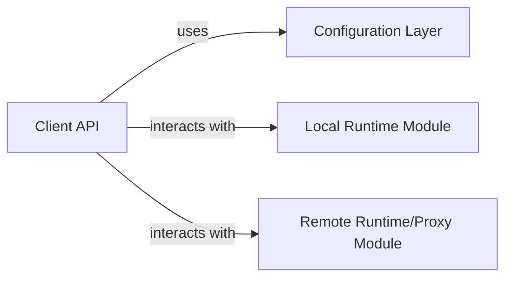

## Details

Overview of browser automation system components and their relationships.

### Client API [[Expand]](./Client_API.md)
The Client API serves as the primary entry point for users, offering a high-level, fluent interface to define and manage browser automation tasks. It abstracts the underlying complexities of browser interaction, providing a consistent experience whether executing locally or remotely via a serverless backend. This component embodies the Client-Side API pattern, crucial for user-friendly interaction with a browser automation library.

**Related Classes/Methods**:

- `all` (1:1)

### Configuration Layer
The Configuration Layer is responsible for managing and providing access to various settings and parameters that control the behavior of the browser automation system. This includes settings for browser launch options, timeouts, proxy configurations, and potentially credentials for remote execution. While not explicitly a single file, its functionality is likely integrated within the Client API and runtime modules, allowing for flexible and dynamic adjustment of automation tasks. It acts as a central point for defining how the automation should behave.

**Related Classes/Methods**:

- `all` (1:1)
- `all` (1:1)
- `all` (1:1)

### Local Runtime Module
The Local Runtime Module is responsible for executing browser automation tasks directly on the local machine where the client application is running. It handles the direct interaction with the locally installed browser (e.g., Chrome) by launching it, managing browser contexts, pages, and executing commands. This module encapsulates the logic for local browser control and ensures that automation scripts can run efficiently without external dependencies beyond the local browser installation.

**Related Classes/Methods**:

- `all` (1:1)
- `all` (1:1)

### Remote Runtime/Proxy Module
The Remote Runtime/Proxy Module facilitates the execution of browser automation tasks on a remote serverless backend. It acts as a proxy, forwarding commands from the Client API to the remote execution environment and relaying results back. This module abstracts the network communication and remote execution details, allowing the Client API to interact with a remote browser instance as if it were local. It handles session management, connection pooling, and error handling for remote operations.

**Related Classes/Methods**:

- `all` (1:1)

### [FAQ](https://github.com/CodeBoarding/GeneratedOnBoardings/tree/main?tab=readme-ov-file#faq)