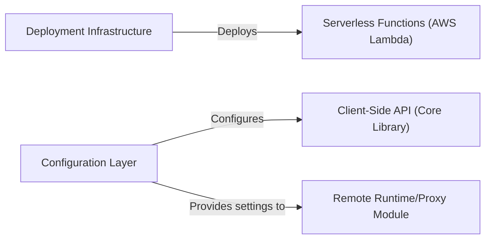

## Details

One paragraph explaining the functionality which is represented by this graph. What the main flow is and what is its purpose.

### Deployment Infrastructure
This component is the core of the deployment aspect, defining and orchestrating the provisioning of serverless resources. It specifies AWS Lambda functions, API Gateway endpoints (for WebSocket communication), and necessary AWS IAM roles and permissions, ensuring the serverless backend is correctly provisioned and configured in the AWS environment.

**Related Classes/Methods**:

- `serverless/serverless.yml` (1:1)

### Configuration Layer
This component provides a robust and flexible mechanism for managing environment-specific settings and switching between local and remote execution modes. It handles parameters such as remote endpoints, API keys, and other configuration details, allowing the system to adapt seamlessly to different deployment environments.

**Related Classes/Methods**: _None_

### Serverless Functions (AWS Lambda)
This component represents the actual serverless compute units (AWS Lambda functions) that execute the backend business logic in response to events, such as API Gateway requests. They are the core of the serverless backend's runtime, processing requests and interacting with other AWS services as needed.

**Related Classes/Methods**: _None_

### Client-Side API (Core Library)
This component provides the primary interface for client applications to interact with the backend services. It encapsulates the logic for making API calls, handling data serialization/deserialization, and managing communication protocols, abstracting the underlying network interactions from the client.

**Related Classes/Methods**:

- `src/api.ts` (1:1)
- `src/types.ts` (1:1)
- `src/util.ts` (1:1)

### Remote Runtime/Proxy Module
This component acts as an intermediary or a runtime environment that facilitates communication with remote services, potentially handling aspects like request routing, authentication, or data transformation before forwarding requests to the actual backend or external APIs. It utilizes settings from the Configuration Layer to determine remote endpoints and operational modes.

**Related Classes/Methods**: _None_

### [FAQ](https://github.com/CodeBoarding/GeneratedOnBoardings/tree/main?tab=readme-ov-file#faq)