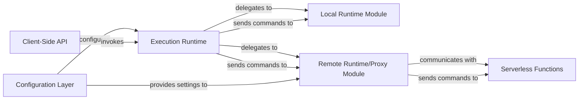

## Details

Overview of the Execution Runtime Subsystem, detailing its central components and their interactions within a browser automation library with serverless capabilities.

### Execution Runtime [[Expand]](./Execution_Runtime.md)
The core orchestrator of the subsystem. It receives browser automation commands and, based on the current configuration, dispatches them to either the Local Runtime Module or the Remote Runtime/Proxy Module. It ensures a consistent execution flow.

**Related Classes/Methods**:

- `runtime_manager` (1:1)

### Client-Side API
The primary interface exposed to end-users for defining and initiating browser automation tasks. It provides a high-level, fluent API that abstracts the complexities of the underlying execution.

**Related Classes/Methods**:

- `chromeless` (1:1)

### Local Runtime Module
Responsible for directly controlling a locally installed Chrome/Chromium instance using the Chrome DevTools Protocol. It translates high-level commands into specific DevTools Protocol messages and manages the local browser session.

**Related Classes/Methods**:

- `local_runtime` (1:1)
- `devtools_protocol_handler` (1:1)

### Remote Runtime/Proxy Module
Manages communication with the serverless backend. It serializes browser automation commands, establishes and maintains WebSocket connections to the remote environment, and forwards commands to the Serverless Functions. It also handles deserializing and returning results from remote execution.

**Related Classes/Methods**:

- `remote_runtime` (1:1)
- `websocket_client` (1:1)
- `command_serializer` (1:1)

### Serverless Functions
Stateless AWS Lambda functions that encapsulate a headless Chrome instance. These functions receive serialized commands from the Remote Runtime/Proxy Module, execute them against the headless browser, and return the results. They are optimized for scalability and efficient resource utilization.

**Related Classes/Methods**:

- `lambda_handler` (1:1)
- `browser_instance_manager` (1:1)

### Configuration Layer
Provides a robust mechanism for configuring the Execution Runtime and its sub-modules. It allows users to easily switch between local and remote execution modes, specify remote endpoints, API keys, and other environment-specific settings.

**Related Classes/Methods**:

- `config` (1:1)
- `settings` (1:1)

### [FAQ](https://github.com/CodeBoarding/GeneratedOnBoardings/tree/main?tab=readme-ov-file#faq)