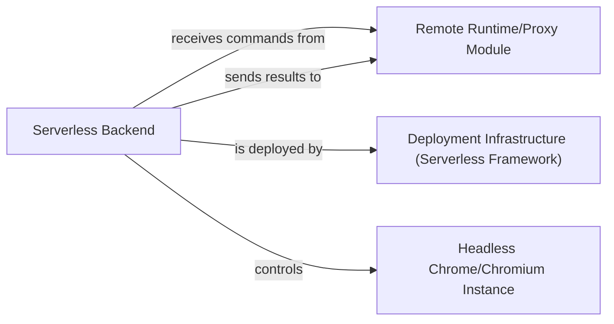

## Details

One paragraph explaining the functionality which is represented by this graph. What the main flow is and what is its purpose.

### Serverless Backend [[Expand]](./Serverless_Backend.md)
The Serverless Backend is the remote execution core of the browser automation library. It consists of stateless AWS Lambda functions, each encapsulating and executing a headless Chrome/Chromium instance. These functions are designed to receive remote browser automation commands, process them efficiently, and return results. Optimized for scalability, parallel execution, and minimizing cold start times, this component enables distributed browser automation.

**Related Classes/Methods**:

- `serverless/src/run.ts`
- `serverless/src/session.ts`

### Remote Runtime/Proxy Module
This module serializes and forwards browser automation commands to the Serverless Backend via WebSocket connections and receives automation results back from it.

**Related Classes/Methods**:

- `src/chrome/remote.ts`
- `src/api.ts`

### Deployment Infrastructure (Serverless Framework)
This component defines and manages the deployment lifecycle of the Serverless Backend's Lambda functions, API Gateway endpoints, and necessary AWS IAM roles.

**Related Classes/Methods**:

- `serverless/serverless.yml`

### Headless Chrome/Chromium Instance
This instance is controlled and interacted with by the Serverless Backend via the Chrome DevTools Protocol to perform browser automation tasks.

**Related Classes/Methods**:

- `serverless/src/run.ts`
- `serverless/src/session.ts`

### [FAQ](https://github.com/CodeBoarding/GeneratedOnBoardings/tree/main?tab=readme-ov-file#faq)