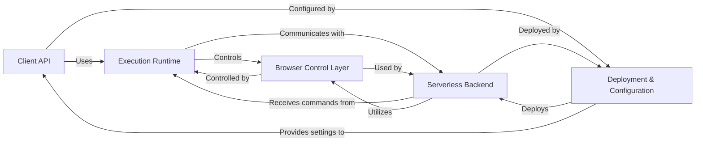

## Details

One paragraph explaining the functionality which is represented by this graph. What the main flow is and what is its purpose.

### Client API [[Expand]](./Client_API.md)
Provides the high-level, fluent interface for users to define browser automation tasks. This is the primary entry point for users interacting with Chromeless.

**Related Classes/Methods**: _None_

### Execution Runtime [[Expand]](./Execution_Runtime.md)
Manages the execution environment for browser automation commands, abstracting whether the commands are run against a local Chrome instance or proxied to a remote serverless environment.

**Related Classes/Methods**: _None_

### Browser Control Layer [[Expand]](./Browser_Control_Layer.md)
Handles the direct interaction with the headless Chrome instance using the Chrome DevTools Protocol, managing browser lifecycle (launch, close) and executing low-level browser commands.

**Related Classes/Methods**: _None_

### Serverless Backend [[Expand]](./Serverless_Backend.md)
Hosts and executes headless Chrome instances as stateless AWS Lambda functions. It receives remote automation commands, processes them, and returns results, optimized for scalability and cold starts.

**Related Classes/Methods**: _None_

### Deployment & Configuration [[Expand]](./Deployment_Configuration.md)
Manages the deployment of serverless resources (Lambda functions, API Gateway) and provides a flexible configuration mechanism for switching between local and remote execution modes, including environment-specific settings.

**Related Classes/Methods**: _None_

### [FAQ](https://github.com/CodeBoarding/GeneratedOnBoardings/tree/main?tab=readme-ov-file#faq)