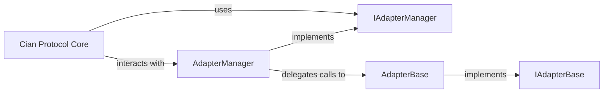

## Details

The Cian Protocol Core leverages a robust Adapter Manager subsystem to facilitate seamless interaction with diverse external DeFi protocols. The `AdapterManager` acts as a central hub, receiving requests from the `Cian Protocol Core` (specifically through its `IControllerLink` interface) and routing them to appropriate concrete adapter implementations. These adapters, built upon the `AdapterBase` abstract contract, adhere to a standardized `IAdapterBase` interface, ensuring consistency and interoperability across various protocol integrations. This architecture promotes modularity, allowing the core protocol logic to remain decoupled from the complexities of individual DeFi protocol interactions, thereby enhancing maintainability and extensibility. The `IAdapterManager` interface defines the external contract for the `AdapterManager`, ensuring standardized communication pathways for the `Cian Protocol Core`.

### AdapterManager
The core component and central entry point for the Cian Protocol Core to interact with external DeFi protocols. It orchestrates calls to specific adapters.

**Related Classes/Methods**:

- `AdapterManager`

### AdapterBase
An abstract base contract that provides common functionalities and a standardized structure for all concrete adapter implementations. It ensures consistency across various protocol integrations.

**Related Classes/Methods**:

- `AdapterBase`

### IAdapterManager
An interface that defines the external Application Binary Interface (ABI) for the AdapterManager.sol contract. It ensures standardized interaction for the Cian Protocol Core.

**Related Classes/Methods**:

- `IAdapterManager`

### IAdapterBase
An interface that defines the common ABI for AdapterBase.sol and all concrete adapter implementations. It enforces a consistent API for all adapters.

**Related Classes/Methods**:

- `IAdapterBase`

### Cian Protocol Core [[Expand]](./Cian_Protocol_Core.md)
Represents the main protocol logic that consumes the services provided by the Adapter Manager subsystem. It initiates requests to interact with external DeFi protocols.

**Related Classes/Methods**:

- `IControllerLink`
- `ControllerLink`

### [FAQ](https://github.com/CodeBoarding/GeneratedOnBoardings/tree/main?tab=readme-ov-file#faq)