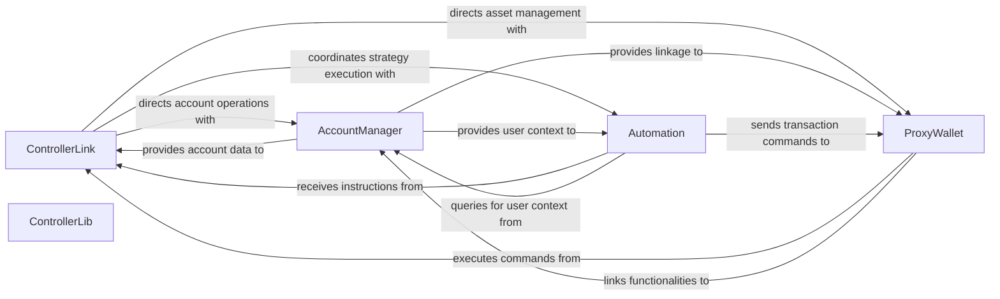

## Details

The core subsystem of the project revolves around the `ControllerLink` as the central orchestrator, managing user accounts and coordinating interactions across other key components. The `AccountManager` is responsible for the lifecycle and authorization of user accounts, providing essential account data to the `ControllerLink` and `Automation` components. The `Automation` component enables automated execution of user strategies, receiving instructions from `ControllerLink` and interacting with `AccountManager` for user context, ultimately sending transaction commands to `ProxyWallet`. The `ProxyWallet` acts as the secure intermediary for managing user assets and executing transactions, receiving commands from `ControllerLink` and `Automation`. The `ControllerLib` is intended to be a utility component, providing reusable functions, though its direct contract definition requires further verification. This architecture ensures a modular and secure system for managing user accounts, automating strategies, and handling asset transactions.

### ControllerLink
The primary orchestrator and central entry point for user interactions and internal operation coordination. It acts as the hub connecting various functionalities within the core protocol, primarily managing account authentication and linking user accounts to the system.

**Related Classes/Methods**:

- `ControllerLink`

### AccountManager
Manages the lifecycle and state of user accounts within the protocol, including creation, modification, and retrieval of account-specific data. It also handles authorization and revocation of operations for accounts.

**Related Classes/Methods**:

- `AccountManager`

### Automation
Facilitates the execution of predefined automated strategies for users, enabling complex, rule-based operations without constant manual intervention. It interacts with accounts to perform automated actions and handles flash loans.

**Related Classes/Methods**:

- `Automation`

### ProxyWallet
Manages user funds and assets, acting as an intermediary for secure and automated transactions. It is a transparent upgradeable proxy that can hold and dispatch assets on behalf of user accounts. The WalletFactory within the same file is responsible for deploying these proxy wallets.

**Related Classes/Methods**:

- `ProxyWallet`

### ControllerLib
(Further investigation needed for this component as its direct contract definition was not found in the expected file. It is likely a utility or interface that is imported and used by other core contracts, ensuring consistency and efficiency across the protocol.)

**Related Classes/Methods**:

- `ControllerLib`

### [FAQ](https://github.com/CodeBoarding/GeneratedOnBoardings/tree/main?tab=readme-ov-file#faq)