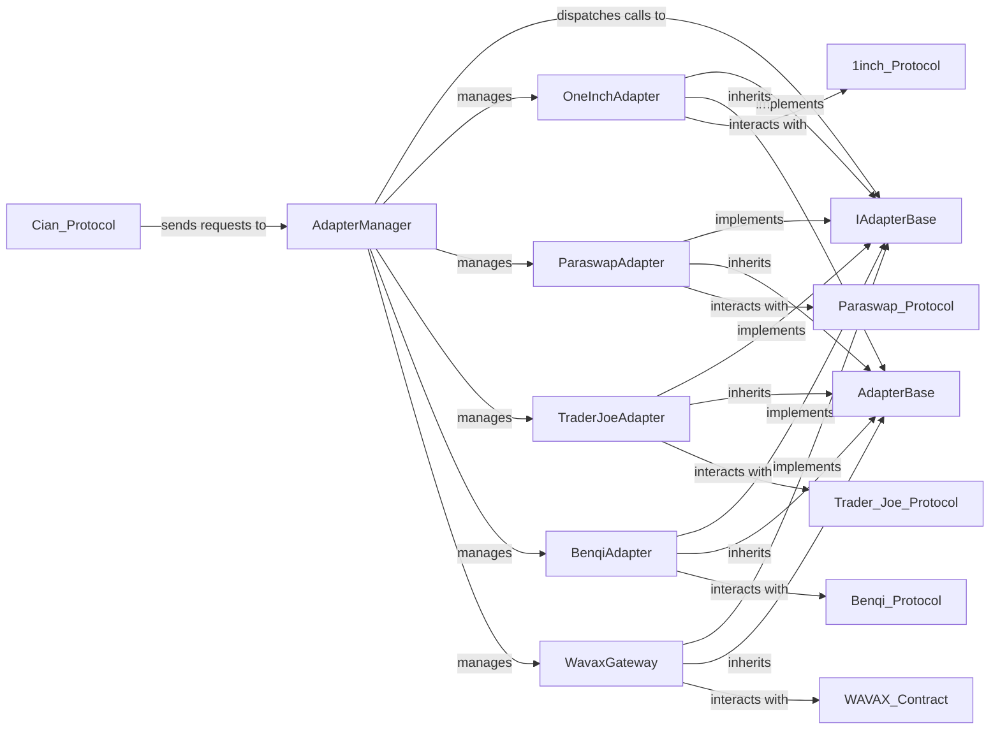

## Details

The Adapter subsystem is a crucial layer within the cian-protocol, designed to facilitate seamless interaction with diverse external Decentralized Finance (DeFi) protocols. At its core, the AdapterManager acts as a central dispatcher, routing incoming requests from the cian-protocol to specialized adapter contracts. These specialized adapters, including OneInchAdapter, ParaswapAdapter, TraderJoeAdapter, BenqiAdapter, and WavaxGateway, are responsible for abstracting the complexities of interacting with specific DeFi platforms. All concrete adapters adhere to the IAdapterBase interface, ensuring a standardized communication mechanism, and inherit common functionalities from AdapterBase. This architecture promotes modularity, reusability, and extensibility, allowing the cian-protocol to easily integrate with new DeFi services.

### AdapterManager
Acts as the central entry point and dispatcher for all external DeFi interactions. It manages a registry of available adapters and routes incoming requests from the core cian-protocol to the appropriate specific adapter based on the target DeFi platform or operation.

**Related Classes/Methods**:

- `AdapterManager`

### AdapterBase
Provides a common base implementation for all individual adapter contracts. It contains shared functionalities, state variables, and modifiers that are common across different DeFi interactions, promoting code reusability and consistency.

**Related Classes/Methods**:

- `AdapterBase`

### IAdapterBase
Defines a consistent interface (set of functions) that all individual adapter contracts must implement. This ensures that the AdapterManager can interact with any adapter polymorphically, regardless of the specific external protocol it integrates with.

**Related Classes/Methods**:

- `IAdapterBase`

### OneInchAdapter
Facilitates token swaps on the 1inch Decentralized Exchange (DEX) aggregator. It translates generic swap requests into specific function calls and data formats required by the 1inch Protocol.

**Related Classes/Methods**:

- `OneInchAdapter`

### ParaswapAdapter
Facilitates token swaps on the Paraswap Decentralized Exchange (DEX) aggregator. It translates generic swap requests into specific function calls and data formats required by the Paraswap Protocol.

**Related Classes/Methods**:

- `ParaswapAdapter`

### TraderJoeAdapter
Facilitates token swaps on the Trader Joe Decentralized Exchange (DEX). It translates generic swap requests into specific function calls and data formats required by the Trader Joe Protocol.

**Related Classes/Methods**:

- `TraderJoeAdapter`

### BenqiAdapter
Handles lending and borrowing interactions with the Benqi lending platform, abstracting away the complexities of interacting with its API.

**Related Classes/Methods**:

- `BenqiAdapter`

### WavaxGateway
A specialized adapter for wrapping and unwrapping AVAX to WAVAX (Wrapped AVAX), crucial for interacting with DeFi protocols that primarily use ERC-20 tokens.

**Related Classes/Methods**:

- `WavaxGateway`

### [FAQ](https://github.com/CodeBoarding/GeneratedOnBoardings/tree/main?tab=readme-ov-file#faq)